## 一、项目规划

### 实现核心

1）权限校验

谁能提代码，谁不能提代码

**2）代码沙箱（安全沙箱）**

用户代码藏毒：写个木马文件、修改系统权限

沙箱：隔离的、安全的环境，用户的代码不会影响到沙箱之外的系统的运行

资源分配：系统的内存有限，所以要限制用户程序的占用资源。

3）判题规则

题目用例的比对，结果的验证

4）任务调度

服务器资源有限，用户要排队，按照顺序去依次执行判题，而不是直接拒绝


### 核心业务流程

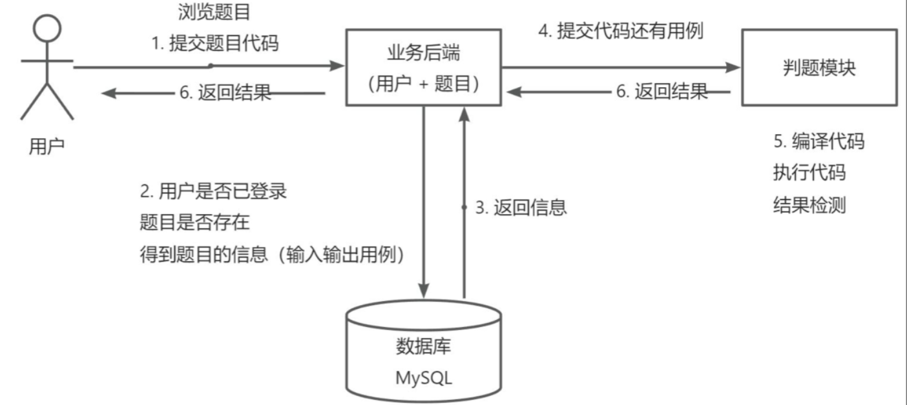

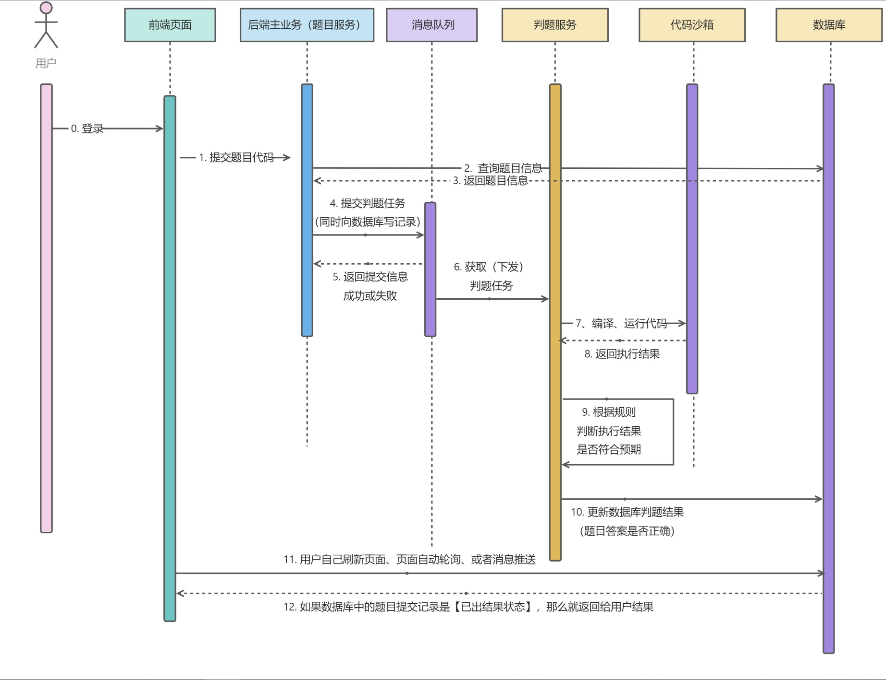

判题服务：获取题目信息、预计的输入输出结果，返回给主业务后端：用户的答案是否正确

代码沙箱：只负责运行代码，给出结果，不管什么结果是正确的。

**实现了解耦**


### 功能模块
1. 用户模块
   1. 注册
   2. 登录
2. 题目模块
   1. 创建题目（管理员）
   2. 删除题目（管理员）
   3. 修改题目（管理员）
   4. 搜索题目（用户）
   5. 在线做题
   6. 提交题目代码
3. 判题模块
   1. 提交判题（结果是否正确与错误）
   2. 错误处理（内存溢出、安全性、超时）
   3. **自主实现代码沙箱**（安全沙箱）
   4. 开放接口（提供一个独立的新服务）


### 项目扩展思路

1. 支持多种语言
2. Remote Judge
3. 完善的评测功能：普通测评、特殊测评、交互测评、在线自测、子任务分组评测、文件IO
4. 统计分析用户判题记录
5. 权限校验


### 技术点

Java 进程控制、Java 安全管理器、部分 JVM 知识点

虚拟机（云服务器）、Docker（代码沙箱实现）

Spring Cloud 微服务 、消息队列、多种设计模式


### 架构设计

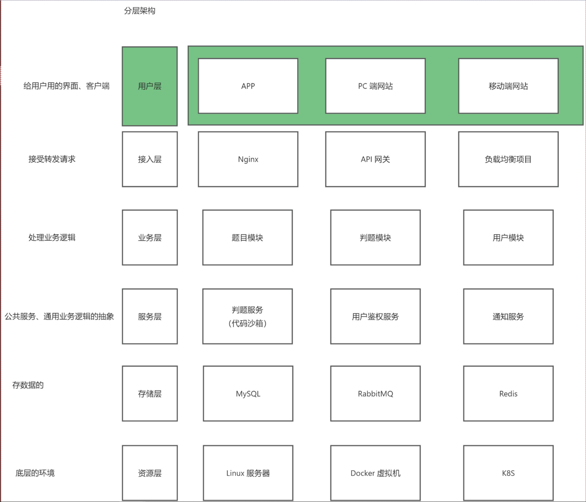


## 二、库表设计

### 用户表

只有管理员才能发布和管理题目，普通用户只能看题

```sql
-- 用户表
create table if not exists user
(
    id           bigint auto_increment comment 'id' primary key,
    userAccount  varchar(256)                           not null comment '账号',
    userPassword varchar(512)                           not null comment '密码',
    unionId      varchar(256)                           null comment '微信开放平台id',
    mpOpenId     varchar(256)                           null comment '公众号openId',
    userName     varchar(256)                           null comment '用户昵称',
    userAvatar   varchar(1024)                          null comment '用户头像',
    userProfile  varchar(512)                           null comment '用户简介',
    userRole     varchar(256) default 'user'            not null comment '用户角色：user/admin/ban',
    createTime   datetime     default CURRENT_TIMESTAMP not null comment '创建时间',
    updateTime   datetime     default CURRENT_TIMESTAMP not null on update CURRENT_TIMESTAMP comment '更新时间',
    isDelete     tinyint      default 0                 not null comment '是否删除',
    index idx_unionId (unionId)
) comment '用户' collate = utf8mb4_unicode_ci;
```


### 题目表

题目标题

题目内容：存放题目的介绍、输入输出提示、描述、具体的详情

题目标签（json 数组字符串）：栈、队列、链表、简单、中等、困难

题目答案：管理员 / 用户设置的标准答案

提交数、通过题目的人数等：便于分析统计（可以考虑根据通过率自动给题目打难易度标签）

判题相关字段：judgeConfig 判题配置（json 对象）：时间限制 timeLimit、内存限制 memoryLimit

judgeCase 判题用例（json 数组）：一个输入用例和一个输出用例

```json
[
  {
    "input": "1 2",
    "output": "3 4"
  },
  {
    "input": "1 3",
    "output": "2 4"
  }
]
```

存 json 的好处：便于扩展，只需要改变对象内部的字段，而不用修改数据库表（可能会影响数据库）

存 json 的前提：1.不需要根据某个字段去倒查这条数据。2.字段含义相关，属于同一类的值。3.字段存储空间占用不能太大

其他扩展字段：通过率、判题类型

```sql
-- 题目表
create table if not exists question
(
    id         bigint auto_increment comment 'id' primary key,
    title      varchar(512)                       null comment '标题',
    content    text                               null comment '内容',
    tags       varchar(1024)                      null comment '标签列表（json 数组）',
    answer     text                               null comment '题目答案',
    submitNum  int  default 0 not null comment '题目提交数',
    acceptedNum  int  default 0 not null comment '题目通过数',
    judgeCase text null comment '判题用例（json 数组）',
    judgeConfig text null comment '判题配置（json 对象）',
    thumbNum   int      default 0                 not null comment '点赞数',
    favourNum  int      default 0                 not null comment '收藏数',
    userId     bigint                             not null comment '创建用户 id',
    createTime datetime default CURRENT_TIMESTAMP not null comment '创建时间',
    updateTime datetime default CURRENT_TIMESTAMP not null on update CURRENT_TIMESTAMP comment '更新时间',
    isDelete   tinyint  default 0                 not null comment '是否删除',
    index idx_userId (userId)
) comment '题目' collate = utf8mb4_unicode_ci;
```


### 题目提交表

judgeInfo（json 对象）

```json
{
  "message": "程序执行信息",
  "time": 1000, // 单位为 ms
  "memory": 1000, // 单位为 kb
}
```

判题信息枚举值：

- Accepted 成功
- Wrong Answer 答案错误
- Compile Error 编译错误
- Memory Limit Exceeded 内存溢出
- Time Limit Exceeded 超时
- Presentation Error 展示错误
- Output Limit Exceeded 输出溢出
- Waiting 等待中
- Dangerous Operation 危险操作
- Runtime Error 运行错误（用户程序的问题）
- System Error 系统错误（做系统人的问题）

```sql
-- 题目提交表
create table if not exists question_submit
(
    id         bigint auto_increment comment 'id' primary key,
    language   varchar(128)                       not null comment '编程语言',
    code       text                               not null comment '用户代码',
    judgeInfo  text                               null comment '判题信息（json 对象）',
    status     int      default 0                 not null comment '判题状态（0 - 待判题、1 - 判题中、2 - 成功、3 - 失败）',
    questionId bigint                             not null comment '题目 id',
    userId     bigint                             not null comment '创建用户 id',
    createTime datetime default CURRENT_TIMESTAMP not null comment '创建时间',
    updateTime datetime default CURRENT_TIMESTAMP not null on update CURRENT_TIMESTAMP comment '更新时间',
    isDelete   tinyint  default 0                 not null comment '是否删除',
    index idx_questionId (questionId),
    index idx_userId (userId)
) comment '题目提交';
```


### 数据库索引

什么情况下适合加索引？如何选择给哪个字段加索引？

答：首先从业务出发，无论是单个索引、还是联合索引，都要从你实际的查询语句、字段枚举值的区分度、字段的类型考虑（where 条件指定的字段）

比如：where userId = 1 and questionId = 2

可以选择根据 userId 和 questionId 分别建立索引（若还需要分别根据这两个字段单独查询）；也可以选择给这两个字段建立联合索引（所查询的字段是绑定在一起的）。

原则上：能不用索引就不用索引；能用单个索引就别用联合 / 多个索引；不要给没区分度的字段加索引（比如性别，就男 / 女）。因为索引也是要占用空间的。


## 三、后端接口开发

### 后端开发流程

1. 根据功能设计库表

2. MyBatisX 插件自动生成对数据库基本的增删改查（entity、mapper、service），把代码从生成包中移到实际项目对应目录中。
3. 实现实体类相关的 DTO、VO、枚举类（用于接受前端请求、或者业务间传递信息），注意**数据脱敏**，比如不能返回全部信息（如密码地址答案等信息），而只能返回部分信息。

3. 编写 Controller 层，实现基本的增删改查和权限校验。

4. 给对应的 json 字段编写独立的类，以方便处理 json 字段中的某个字段，如 judgeConfig、judgeCase。

   **什么情况下要加业务前缀？什么情况下不加？比如类名取judgeCase还是QuestionJudgeCase？**

   加业务前缀的好处，防止多个表都有类似的类，产生冲突；不加的前提，因为可能这个类是多个业务之间共享的，能够复用的。

5. 校验 Controller 层的代码，看看除了要调用的方法缺失外，还有无报错。

6. 实现 Service 层的代码。

7. 编写 QuestionVO 的 json和对象的相互转换的方法。

8. 编写枚举类。

9. 利用**Swagger测试接口**。


### MyBatisX 插件代码生成

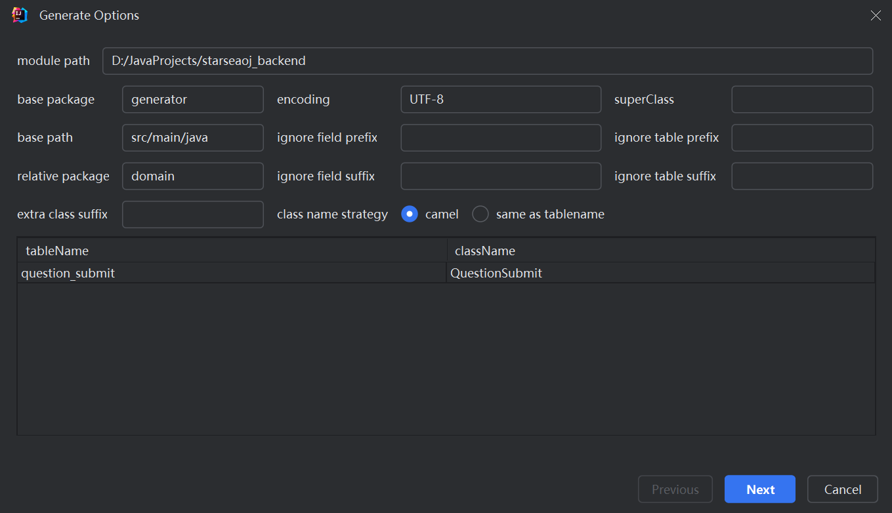

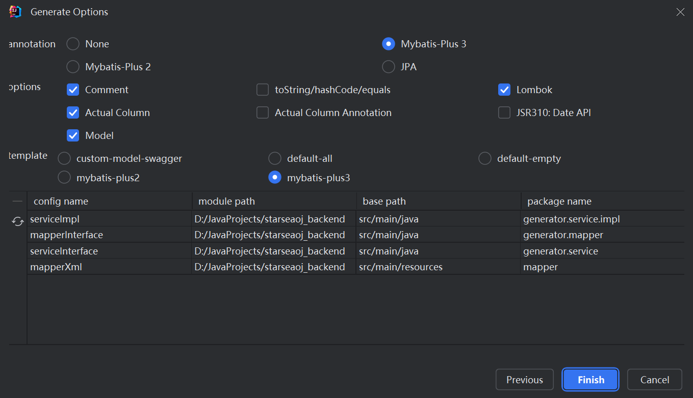


为了**防止**用户按照 id 顺序**爬取题目**，把 id 的生成规则改为 ASSIGN_ID （雪花算法生成）而不是从 1 开始自增，示例代码如下：

```java
/**
* id
*/
@TableId(type = IdType.ASSIGN_ID)
private Long id;
```


## 四、判题机架构

### 判题模块和代码沙箱的关系

判题模块：调用代码沙箱，把代码和输入交给代码沙箱去执行

代码沙箱：只负责接受代码和输入，返回编译运行的结果，不负责判题（可以作为独立的项目 / 服务，提供给其他的需要执行代码的项目去使用）

这两个模块**完全解耦**：

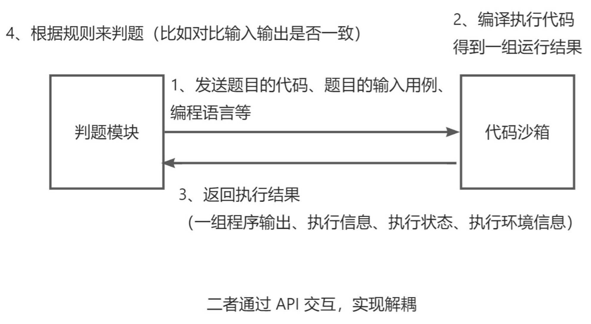


### 性能优化点（批处理）

代码沙箱要接受和输出一组运行用例，包含题目代码、编程语言和**多个输入用例**，而不是单个输入样例。

因为每个用例单独调用一次代码沙箱，会调用多次接口、需要多次网络传输、程序要多次编译、记录程序的执行状态（重复的代码不重复编译）


### 为什么代码沙箱不使用消息队列？

因为为了使判题机模块更加通用且方便实用，发送请求调用即可使用，而不需要再去部署消息队列。


### 代码沙箱架构开发

1. 定义代码沙箱的接口，提高通用性

   项目代码**只调用接口而不调用具体的实现类**的原因：这样在以后如果使用其他的代码沙箱实现类时，就不用去调用代码沙箱的代码处修改名称了， 便于扩展。

   代码沙箱的请求接口中，timeLimit 可加可不加，若需要设置即时中断程序可添加。

   扩展思路：增加一个查看代码沙箱状态的接口。

   

2. 定义多种不同的代码沙箱实现。

   示例代码沙箱：仅为了跑通业务流程

   远程代码沙箱：实际调用接口的沙箱

   第三方代码沙箱：调用网上现成的代码沙箱，https://github.com/criyle/go-judge

   

   #### 对象赋值优化 - 构造器模式 - Lombok Builder 注解

   （1）实体类加上 @Builder 等注解：

   ```java
   @Data
   @Builder
   @NoArgsConstructor
   @AllArgsConstructor
   public class ExecuteCodeRequest {
   
       private List<String> inputList;
   
       private String code;
   
       private String language;
   }
   ```

   （2）可以使用链式的方式更方便地给对象赋值：

   ```java
   ExecuteCodeRequest executeCodeRequest = ExecuteCodeRequest.builder()
       .code(code)
       .language(language)
       .inputList(inputList)
       .build();
   ```

   

3. 编写**单元测试**，验证单个代码沙箱的执行

   ```java
   @SpringBootTest
   class CodeSandboxTest {
   
       /**
        * 测试代码沙箱，使用构造器模式赋值，判断代码沙箱返回是否为空
        */
       @Test
       void executeCode() {
           CodeSandbox codeSandbox = new ExampleCodeSandbox();
           String code = "int main(){}";
           String language = QuestionSubmitLanguageEnum.JAVA.getValue();
           List<String> inputList = Arrays.asList("1 2", "3 4");
           ExecuteCodeRequest executeCodeRequest = ExecuteCodeRequest.builder()
                   .code(code)
                   .language(language)
                   .inputList(inputList)
                   .build();
           ExecuteCodeResponse executeCodeResponse = codeSandbox.executeCode(executeCodeRequest);
           Assertions.assertNotNull(executeCodeResponse);
       }
   }
   ```

   当前存在**问题**：把 new 某个沙箱的代码写死了，如果后面项目要改用其他沙箱，可能要改很多地方的代码。

   

4. 使用**工厂模式优化**，根据用户传入的字符串参数（沙箱类别），来生成对应的代码沙箱实现类，**提高通用性**。

   ```java
   /**
    * @author guiyi
    * @Date 2024/8/11 下午4:30:50
    * @ClassName com.guiyi.starseaoj.judge.codesandbox.CodeSandboxFactory
    * @function --> 代码沙箱工厂（根据字符串参数创建指定的代码沙箱示例）
    */
   public class CodeSandboxFactory {
       /**
        * 创建代码沙箱
        *
        * @param type
        * @return
        */
       public static CodeSandbox newInstance(String type) {
           switch (type) {
               case "example":
                   return new ExampleCodeSandbox();
               case "remote":
                   return new RemoteCodeSandbox();
               case "thirdParty":
                   return new ThirdPartyCodeSandbox();
               default:
                   return new ExampleCodeSandbox();
           }
       }
   }
   ```

   >扩展思路：如果确定代码沙箱示例不会出现线程安全问题、可复用，那么可以使用单例工厂模式

   修改单元测试验证静态工厂

    ```java
    /**
     * 测试静态工厂创建代码沙箱
     */
    @Test
    void executeCodeFactory() {
        List<String> codeSandboxTypeList = Arrays.asList("example", "remote", "thirdParty");
        for (String type : codeSandboxTypeList) {
            CodeSandbox codeSandbox = CodeSandboxFactory.newInstance(type);
            String code = "int main(){}";
            String language = QuestionSubmitLanguageEnum.JAVA.getValue();
            List<String> inputList = Arrays.asList("1 2", "3 4");
            ExecuteCodeRequest executeCodeRequest = ExecuteCodeRequest.builder()
                    .code(code)
                    .language(language)
                    .inputList(inputList)
                    .build();
            ExecuteCodeResponse executeCodeResponse = codeSandbox.executeCode(executeCodeRequest);
        }
    }
    ```


5. 参数配置化，把项目中的一些可以自定义的选项或字符串，写到配置文件中。这样其他开发者只需要改配置文件，而不需要去看项目代码，就能够自定义使用项目的更多功能。

   application.yml 配置文件中指定变量：

   ```yaml
   # 代码沙箱配置
   codesandbox:
     type: example
   ```

   在 Spring 的 Bean 中通过 @Value 注解读取，:thirdParty是设置默认值为thirdParty：

   ```java
   @Value("${codesandbox.type:thirdParty}")
   private String type;
   ```


6. 代码沙箱能力增强 - **代理模式优化**

   比如：我们需要在调用代码沙箱前，输出请求参数**日志**；在代码沙箱调用后，输出响应结果日志，便于管理员去分析。

   每个代码沙箱类都写一遍 log.info？难道每次调用代码沙箱前后都执行 log？

   使用**代理模式**，提供一个 Proxy，来增强代码沙箱的能力（代理模式的作用就是增强能力）

   

   原本：需要用户自己去调用多次

   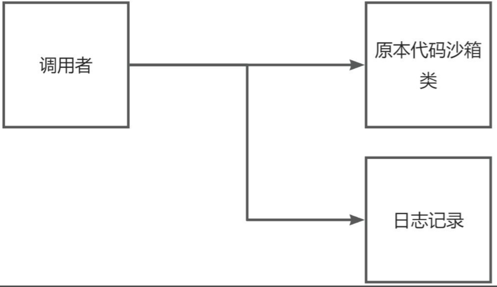

   

   使用代理后：不仅不用改变原本的代码沙箱实现类，而且对调用者来说，调用方式几乎没有改变，也不需要在每个调用沙箱的地方去写统计代码。

   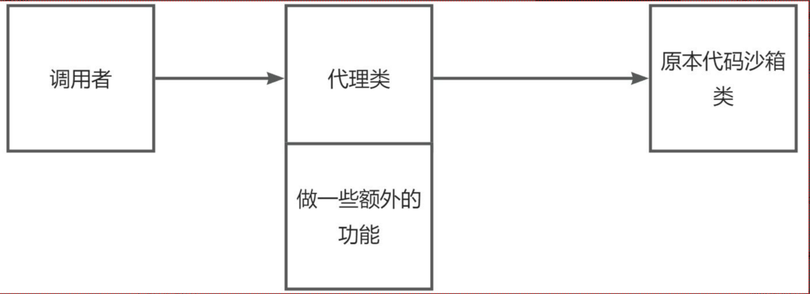

   

   代理模式的实现原理：

   1. 实现被代理的接口
   2. 通过构造函数接受一个被代理的接口实现类
   3. 调用被代理的接口实现类，在调用前后增加对应的操作

   ```java
   /**
    * @author guiyi
    * @Date 2024/8/11 下午5:30:46
    * @ClassName com.guiyi.starseaoj.judge.codesandbox.CodeSandboxProxy
    * @function --> 代码沙箱代理类
    */
   @Slf4j
   @AllArgsConstructor
   public class CodeSandboxProxy implements CodeSandbox {
   
       private final CodeSandbox codeSandbox;
   
       @Override
       public ExecuteCodeResponse executeCode(ExecuteCodeRequest executeCodeRequest) {
           log.info("代码沙箱请求参数：{}", executeCodeRequest.toString());
           ExecuteCodeResponse executeCodeResponse = codeSandbox.executeCode(executeCodeRequest);
           log.info("代码沙箱响应结果：{}", executeCodeResponse.toString());
           return executeCodeResponse;
       }
   }
   ```

   使用方式：
    ```
    CodeSandbox codeSandbox = CodeSandboxFactory.newInstance(type);
    // 使用codeSandbox创建代理类对象重新赋值给codeSandbox
    codeSandbox = new CodeSandboxProxy(codeSandbox);
    ```


7. 实现示例的代码沙箱

   ```java
   /**
    * @author guiyi
    * @Date 2024/8/11 下午4:04:24
    * @ClassName com.guiyi.starseaoj.judge.codesandbox.impl.CodeSandboxImpl
    * @function --> 示例代码沙箱（仅为了跑通业务流程）
    */
   public class ExampleCodeSandbox implements CodeSandbox {
       @Override
       public ExecuteCodeResponse executeCode(ExecuteCodeRequest executeCodeRequest) {
           List<String> inputList = executeCodeRequest.getInputList();
   
           // 使用executeCodeResponse.allset快速生成set带阿米
           ExecuteCodeResponse executeCodeResponse = new ExecuteCodeResponse();
           executeCodeResponse.setOutputList(inputList);
           executeCodeResponse.setMessage("测试执行成功");
           executeCodeResponse.setStatus(QuestionSubmitStatusEnum.SUCCEED.getValue());
   
           JudgeInfo judgeInfo = new JudgeInfo();
           judgeInfo.setMessage(JudgeInfoMessageEnum.ACCEPTED.getText());
           judgeInfo.setMemory(100L);
           judgeInfo.setTime(100L);
   
           executeCodeResponse.setJudgeInfo(judgeInfo);
   
           return executeCodeResponse;
       }
   }
   ```


### 判题服务开发

定义单独的 judgeService 类，而不是把所有判题相关的代码写到 questionSubmitService 里，有利于后续的模块抽离、微服务改造。


#### 判题服务业务流程

1. 传入题目的提交 id，获取到对应的题目、提交信息（包含代码、编程语言等）

2. 如果题目提交状态不为 “待判题”，就不往下执行

3. 更改判题（题目提交）的状态为 “判题中”，防止重复执行，也能让用户即时看到状态

4. 调用沙箱，获取到执行结果

5. 根据沙箱的执行结果，设置题目的判题状态和信息

   **判断逻辑：**

   （1）先判断沙箱执行的结果输出数量是否和预期输出数量相等

   （2）依次判断每一项输出和预期输出是否相等

   （3）判题题目的限制是否符合要求

   （4）可能还有其他的异常情况

```java
/**
 * @author guiyi
 * @Date 2024/8/11 下午6:21:32
 * @ClassName com.guiyi.starseaoj.judge.JudgeServiceImpl
 * @function -->
 */
@Service // 和 @Component 没有实际区别，仅做语义区分，表示这是服务层
public class JudgeServiceImpl implements JudgeService {

    @Resource
    private QuestionService questionService;

    @Resource
    private QuestionSubmitService questionSubmitService;

    /**
     * 从配置文件中获取type，设置默认值为thirdParty
     */
    @Value("${codesandbox.type:thirdParty}")
    private String type;

    @Override
    public QuestionSubmitVO doJudge(long questionSubmitId) {
        // 1.传入题目的提交 id，获取到对应的题目、提交信息（包含代码、编程语言等）
        QuestionSubmit questionSubmit = questionSubmitService.getById(questionSubmitId);
        if (questionSubmit == null) {
            throw new BusinessException(ErrorCode.NOT_FOUND_ERROR, "提交信息不存在");
        }
        Long questionId = questionSubmit.getQuestionId();
        Question question = questionService.getById(questionId);
        if (question == null) {
            throw new BusinessException(ErrorCode.NOT_FOUND_ERROR, "题目不存在");
        }

        // 2.如果题目提交状态不为 “待判题”，就不往下执行
        if (!questionSubmit.getStatus().equals(QuestionSubmitStatusEnum.WAITING.getValue())) {
            throw new BusinessException(ErrorCode.OPERATION_ERROR, "题目正在判题中");
        }

        // 3.更改判题（题目提交）的状态为 “判题中”，防止重复执行，也能让用户即时看到状态
        QuestionSubmit questionSubmitUpdate = new QuestionSubmit();
        questionSubmitUpdate.setId(questionId);
        questionSubmitUpdate.setStatus(QuestionSubmitStatusEnum.RUNNING.getValue());
        boolean update = questionSubmitService.updateById(questionSubmitUpdate);
        if (!update) {
            throw new BusinessException(ErrorCode.SYSTEM_ERROR, "题目状态更新失败");
        }

        // 4.调用沙箱，获取到执行结果
        CodeSandbox codeSandbox = CodeSandboxFactory.newInstance(type);
        // 使用codeSandbox创建代理类对象重新赋值给codeSandbox
        codeSandbox = new CodeSandboxProxy(codeSandbox);
        String language = questionSubmit.getLanguage();
        String code = questionSubmit.getCode();

        // 获取输入样例
        String judgeCaseStr = question.getJudgeCase();
        List<JudgeCase> judgeCaseList = JSONUtil.toList(judgeCaseStr, JudgeCase.class);
        List<String> inputList = judgeCaseList.stream()
                .map(JudgeCase::getInput)
                .collect(Collectors.toList());

        ExecuteCodeRequest executeCodeRequest = ExecuteCodeRequest.builder()
                .code(code)
                .language(language)
                .inputList(inputList)
                .build();
        ExecuteCodeResponse executeCodeResponse = codeSandbox.executeCode(executeCodeRequest);
        List<String> outputList = executeCodeResponse.getOutputList();

        // 5.根据沙箱的执行结果，设置题目的判题状态和信息
        JudgeInfoMessageEnum judgeInfoMessageEnum = JudgeInfoMessageEnum.WAITING;
        // 先判断沙箱执行的结果输出数量是否和预期输出数量相等
        if (outputList.size() != inputList.size()) {
            judgeInfoMessageEnum = JudgeInfoMessageEnum.WRONG_ANSWER;
            return null;
        }
        // 依次判断每一项输出和预期输出是否相等
        for (int i = 0; i < outputList.size(); i++) {
            JudgeCase judgeCase = judgeCaseList.get(i);
            if (judgeCase.getOutput().equals(outputList.get(i))) {
                judgeInfoMessageEnum = JudgeInfoMessageEnum.WRONG_ANSWER;
                return null;
            }
        }
        // 判题题目的限制是否符合要求
        JudgeInfo judgeInfo = executeCodeResponse.getJudgeInfo();
        Long memory = judgeInfo.getMemory();
        Long time = judgeInfo.getTime();
        String judgeConfigStr = question.getJudgeConfig();
        JudgeConfig judgeConfig = JSONUtil.toBean(judgeConfigStr, JudgeConfig.class);
        Long needTimeLimit = judgeConfig.getTimeLimit();
        Long needMemoryLimit = judgeConfig.getMemoryLimit();
        if (memory > needMemoryLimit) {
            judgeInfoMessageEnum = JudgeInfoMessageEnum.MEMORY_LIMIT_EXCEEDED;
            return null;
        }
        if (time > needTimeLimit) {
            judgeInfoMessageEnum = JudgeInfoMessageEnum.TIME_LIMIT_EXCEEDED;
            return null;
        }
        return null;
    }
}
```

第三步之所以**创建新的QuestionSubmit对象而不是使用第一步的对象**，好处如下：

（1）最小化更新字段：确保只更新需要的字段，避免不必要的数据变动。

（2）保护原始数据：保留第一步中获取的对象的完整性。如果在后续逻辑中还需要使用原始的数据，可以保证该对象没有被修改。

（3）提高代码的可读性和维护性：开发者看到新建的对象时，可以明确地知道这个对象是专门用于更新操作的，而不会影响其他逻辑。

（4）防止不必要的数据加载：如果在 `updateById` 时使用原始对象，可能会携带一些关联的数据，这些数据可能并不需要被更新。而使用新对象只包含需要更新的字段，可以减少数据传输的开销。


#### 策略模式优化

判题策略可能会有很多种，比如：代码沙箱本身执行程序需要消耗时间，这个时间不同的编程语言是不同的，比如沙箱执行 Java 可能要额外花 10 秒。如果把所有的判题逻辑、if ... else ... 代码全部混在一起写，会显得代码十分臃肿。

对此可以采用策略模式，针对不同的情况，定义独立的策略，便于分别修改策略和维护。


实现步骤如下：

1. 定义判题策略接口，让代码更加通用化：

   ```java
   /**
    * @author guiyi
    * @Date 2024/8/11 下午8:09:28
    * @ClassName com.guiyi.starseaoj.judge.strategy.JudgeStrategy
    * @function --> 判题策略
    */
   public interface JudgeStrategy {
       /**
        * 执行判题
        *
        * @param judgeContext
        * @return
        */
       JudgeInfo doJudge(JudgeContext judgeContext);
   }
   ```


2. 定义判题上下文对象，用于定义在策略中传递的参数（相当于 DTO）：

   ```java
   /**
    * @author guiyi
    * @Date 2024/8/11 下午11:49:50
    * @ClassName com.guiyi.starseaoj.judge.strategy.JudgeContext
    * @function --> 上下文-策略参数传递
    */
   @Data
   public class JudgeContext {
       private JudgeInfo judgeInfo;
   
       private List<String> inputList;
   
       private List<String> outputList;
   
       private Question question;
   
       private List<JudgeCase> judgeCaseList;
   
       private QuestionSubmit questionSubmit;
   }
   ```


3. 创建默认策略类DefaultJudgeStrategy，实现JudgeStrategy接口，将JudgeServiceImpl类中的判题策略部分搬到doJudge方法中。

   

4. 再新增一种判题策略类JavaLanguageJudgeStrategy，可以通过 if ... else ... 的方式选择使用哪种策略。但是，如果选择某种判题策略的过程比较复杂，都写在调用判题服务的代码中会有大量 if ... else ...，所以最好单独编写一个判断策略的类。

   ```java
   JudgeStrategy judgeStrategy = new DefaultJudgeStrategy();
   if (language.equals("java")) {
       judgeStrategy = new JavaLanguageJudgeStrategy();
   }
   JudgeInfo judgeInfo = judgeStrategy.doJudge(judgeContext);
   ```


5. 定义 JudgeManager，目的是尽量简化对判题功能的调用，**让调用方写最少的代码、调用最简单**。对于**判题策略的选取，移到 JudgeManager 里**处理。

   ```java
   /**
    * @author guiyi
    * @Date 2024/8/12 上午12:28:28
    * @ClassName com.guiyi.starseaoj.judge.JudgeManager
    * @function --> 判题管理（简化调用）
    */
   @Service
   public class JudgeManager {
       /**
        * 执行判题
        *
        * @param judgeContext
        * @return
        */
       JudgeInfo doJudge(JudgeContext judgeContext) {
           QuestionSubmit questionSubmit = judgeContext.getQuestionSubmit();
           String language = questionSubmit.getLanguage();
   
           JudgeStrategy judgeStrategy = new DefaultJudgeStrategy();
           if ("java".equals(language)) {
               judgeStrategy = new JavaLanguageJudgeStrategy();
           }
   
           return judgeStrategy.doJudge(judgeContext);
       }
   }
   ```


## 五、代码沙箱 —— Java实现

项目地址：https://github.com/guiyi886/starseaoj_code_sandbox


### 代码沙箱项目初始化

**代码沙箱的定位**：只负责接受代码和输入，返回编译运行的结果，不负责判题（可以作为独立的项目 / 服务，提供给其他的需要执行代码的项目去使用）

由于代码沙箱是能够通过 API 调用的**独立服务**，所以新建一个 Spring Boot Web 项目。最终这个项目要提供一个能够执行代码、操作代码沙箱的接口。

使用 IDEA 的 Spring Boot 项目初始化工具，选择 **Java 8、Spring Boot 2.7 版本**。

**注意**：由于Spring Boot将来会全力支持Java17，不再维护支持Java8的版本，因此官方服务器默认禁用了对Java 8的支持。此时需要将服务器URL改为阿里云的： https://start.aliyun.com/

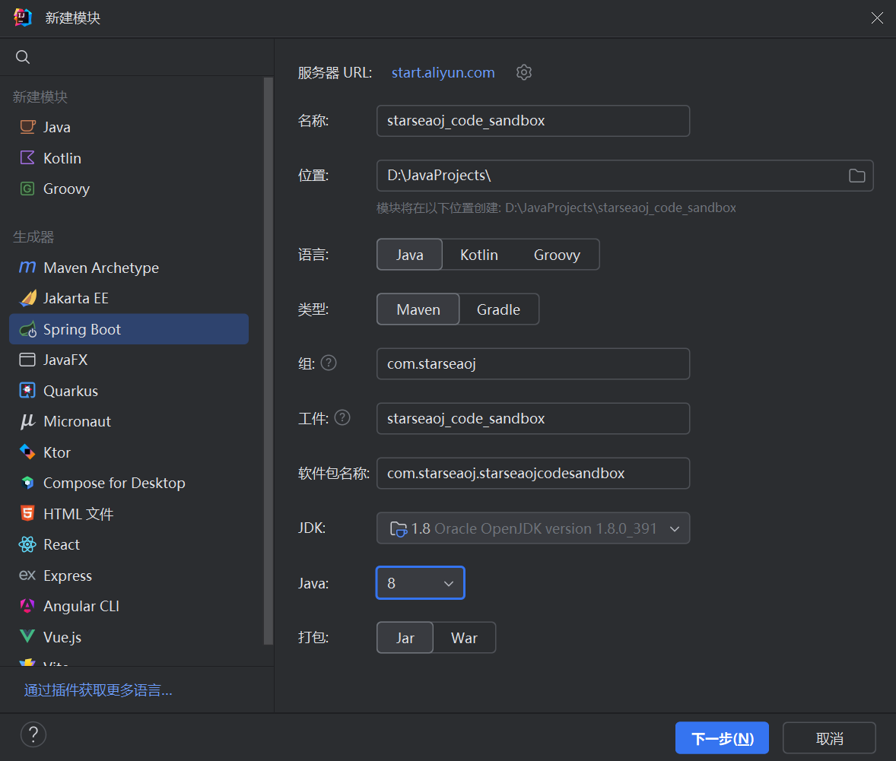


### Java 原生实现代码沙箱

原生：尽可能不借助第三方库和依赖，用最干净、最原始的方式实现代码沙箱

#### 命令行执行程序流程

接收代码 => 编译代码（javac） => 执行代码（java）

 javac 编译，用 `-encoding utf-8` 参数解决中文乱码问题，使用`--release` 8兼容Java 8的运行时：

```shell
javac SimpleCompute.java -encoding utf-8 --release 8
```

java 执行，`-cp` 是 `-classpath` 的缩写，用于指定Java类路径。类路径是JVM查找类文件（.class文件）的路径。`-cp .` 表示将当前目录（`.`）作为类路径。：

```shell
java -cp . SimpleCompute 1 6
```

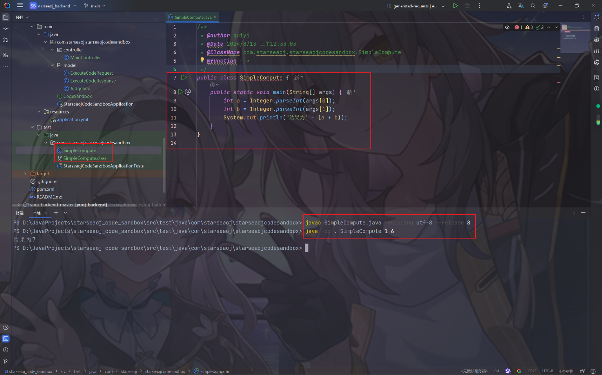


#### 统一类名

实际的 OJ 系统中，对用户输入的代码有一定的要求。便于系统进行统一处理和判题。

此处我们把用户输入代码的类名限制为 Main（如蓝桥杯），可以减少编译时类名不一致的风险，并且无需从用户代码中提取类名。

文件名 Main.java，示例代码如下：

```java
public class Main {
    public static void main(String[] args) {
        int a = Integer.parseInt(args[0]);
        int b = Integer.parseInt(args[1]);
        System.out.println("结果:" + (a + b));
    }
}
```

实际执行命令时，可以统一使用 Main 类名，类似如下：

```shell
javac Main.java -encoding utf-8 --release 8
java -cp . Main 1 6
```


### 核心流程实现

核心实现思路：用程序代替人工，用程序来操作命令行，去编译执行代码

核心依赖：Java 进程类 Process

1. 把用户的代码保存为文件
2. 编译代码，得到 class 文件
3. 执行代码，得到输出结果
4. 收集整理输出结果
5. 文件清理，释放空间
6. 错误处理，提升程序健壮性


#### 1.保存代码文件

引入 Hutool 工具类，提高操作文件效率：

```xml
<dependency>
    <groupId>cn.hutool</groupId>
    <artifactId>hutool-all</artifactId>
    <version>5.8.26</version>
</dependency>
```


新建目录，将每个用户的代码都存放在独立目录tmpCode下，通过 UUID 随机生成目录名，便于隔离和维护：

```java
// 获取当前项目路径
String userDir = System.getProperty("user.dir");

// 用File.separator，因为windows和linux的分隔符不一样，一个\\，一个/
String tmpCodePath = userDir + File.separator + TMP_CODE_DIR;

// 创建临时目录
if (!FileUtil.exist(tmpCodePath)) {
    FileUtil.mkdir(tmpCodePath);
}

// 隔离存放用户代码
String userCodeParentPath = tmpCodePath + File.separator + UUID.randomUUID();
String userCodePath = userCodeParentPath + File.separator + JAVA_CLASS_NAME;
File userCodeFile = FileUtil.writeString(code, userCodePath, StandardCharsets.UTF_8);
```


#### 2.编译代码


## Bug 解决
### 1.md文档上传到github后图片不显示。

通过分析网页点击后的url路径名知，网页会将 "photo/Snipaste_2024-08-08_03-27-12.png" 的 ’/' 识别为 %5c ，导致图片名为"photo%5cSnipaste_2024-08-08_03-27-12.png" ，故而找不到图片。

解决方法：将 / 改为 \ 即可。

ps. 在本地电脑时两个都可以正确识别，且默认为 / 

   

### 2.springboot程序启动失败，查看输出可知是循环依赖问题。

解决：找到循环依赖的字段，在其上方添加**@Lazy注解**，延迟这个 Bean 的初始化。

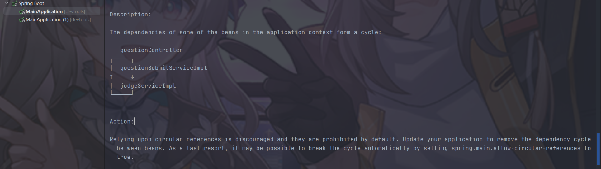


### 3.发现前端页面在登录后，右上角身份信息仍然显示未登录。  

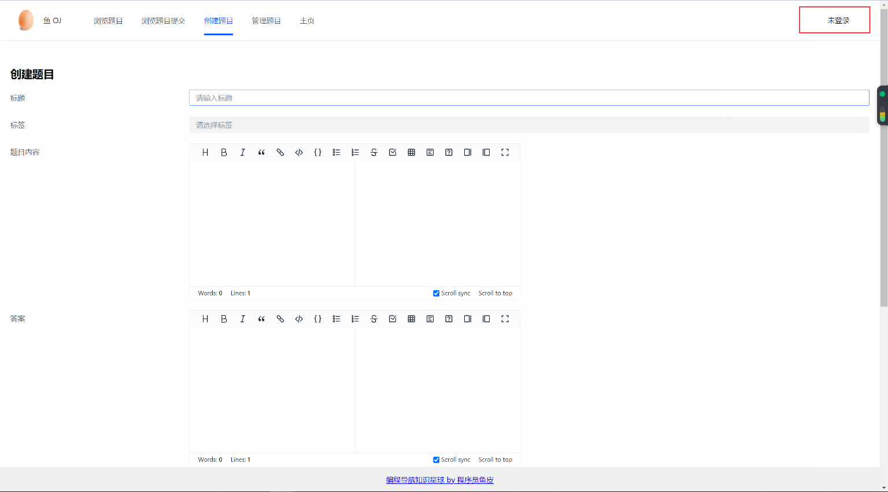

   

 首先查看网络请求，定位报文和api接口。

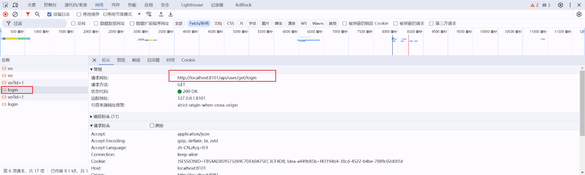

   

使用Swagger接口文档测试该接口，发现userName字段为null。查看后端日志输出，发现从数据库查到的数据中，用户名在userAccount字段上，userName字段为null，而前端获取用户名的依据是userName，因此导致该问题。

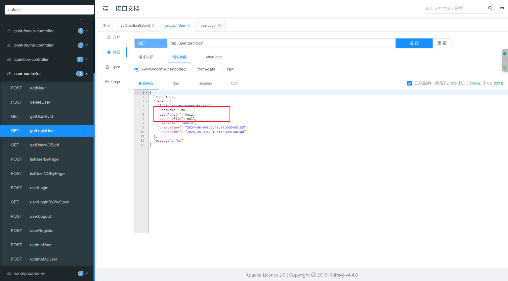

 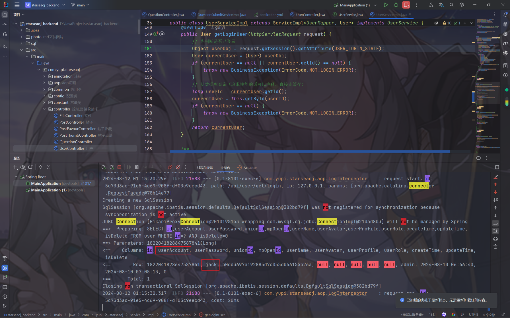

   

解决方法：在注册业务中，将用户名也设为账号名，比如都为jack。

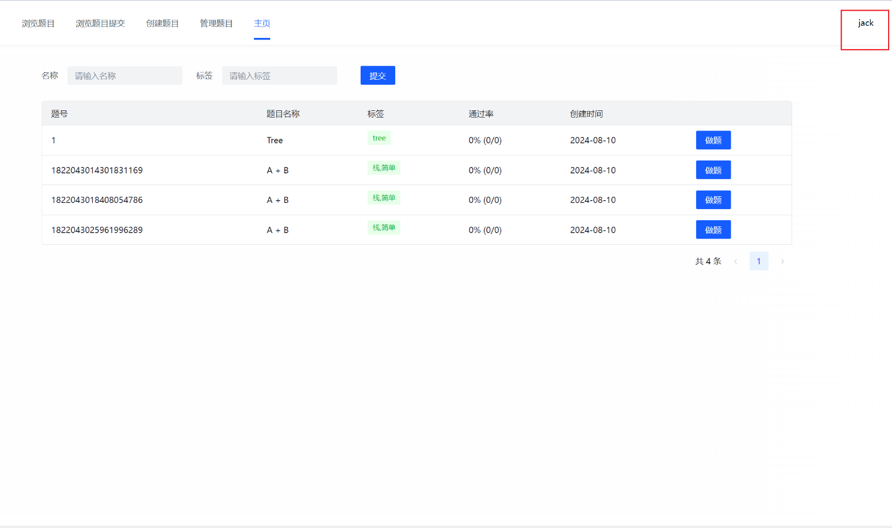

   

### 4.测试代码沙箱时，发现判题信息均为null。

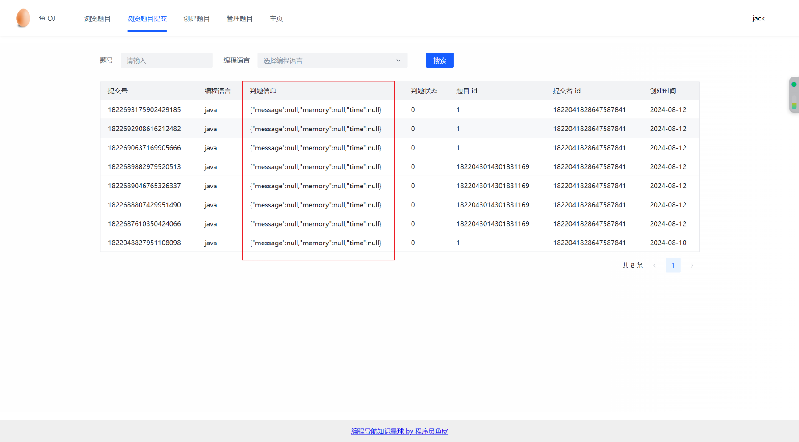

   

推测题目提交接口存在问题，观察该接口业务层代码，定位到判题服务部分。在doJudge方法中打上断点后，前端重新提交代码，发现断点未生效，说明该异步任务并未执行。

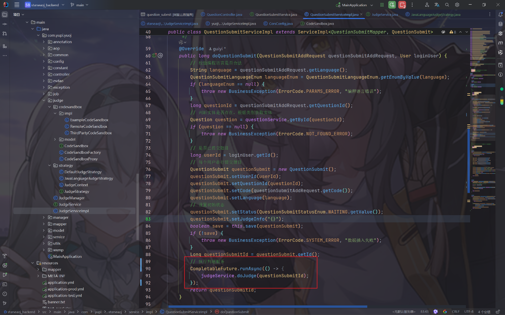

   

查阅资料后，在任意一个配置类上添加@EnableAsync开启异步功能，并在doJudge方法上添加@Async注解。再次提交代码后发现成功进入doJudge方法，放行断点后发现抛出异常，分析异常信息可知问题出现在76行左右，定位到代码的更改判题部分。逐行查看代码、以及根据日志中的sql语句的id、表中的id比对，发现是72行的questionId出错，应该为questionSubmitId。

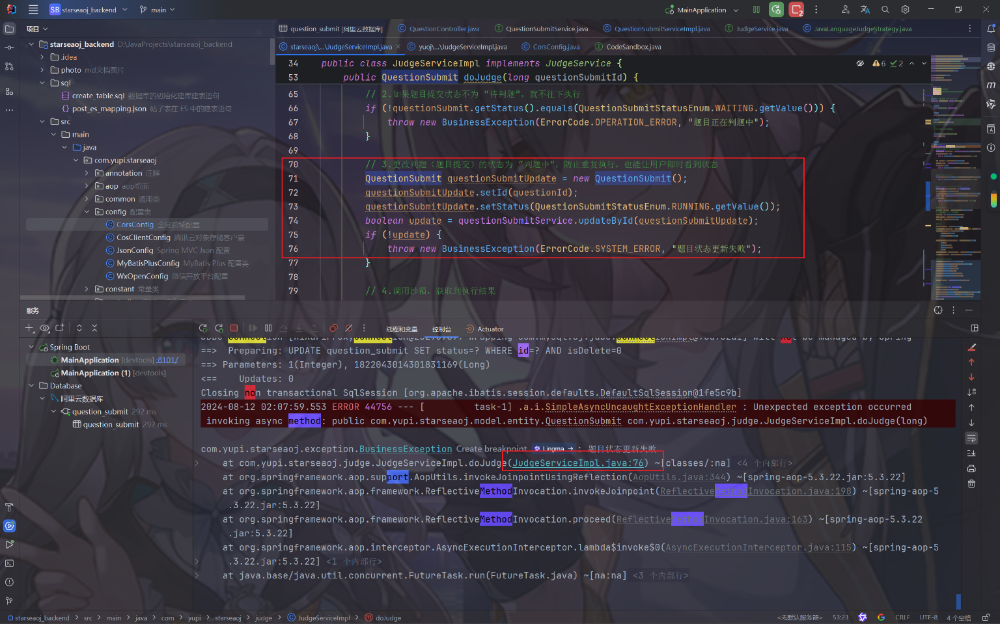

   

再次提交代码，发现此时已经有判题结果了，业务流程已经跑通。

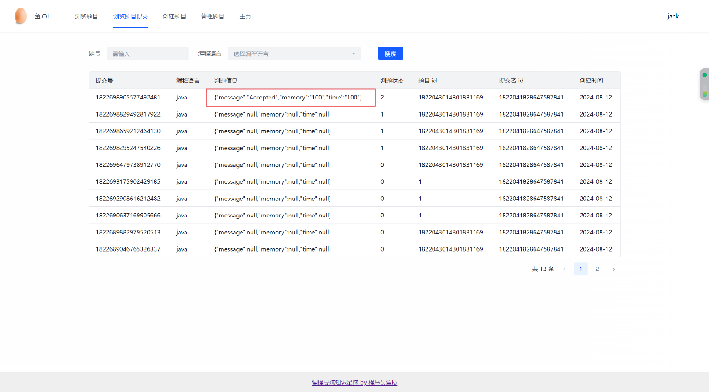


### 5.多模块下使用System.getProperty("user.dir");获取根目录失败。

在第二个模块使用System.getProperty("user.dir");获取根目录路径时，返回的是第一个模块的根目录。

解决方法：根据当前类路径获取父级目录得到根目录。

```java
ClassLoader classLoader = getClass().getClassLoader();
File file = new File(classLoader.getResource("").getFile());
String projectRoot = file.getParentFile().getParentFile().getPath();
```


