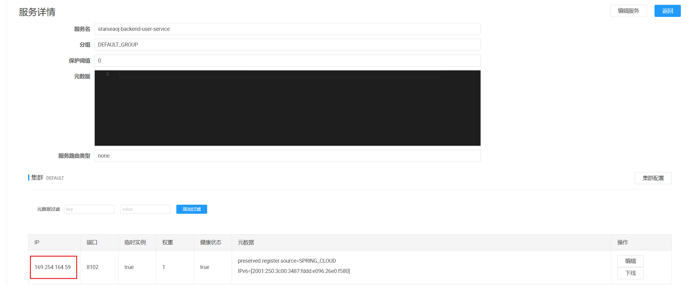

## 一、项目规划

### 实现核心

1）权限校验

谁能提代码，谁不能提代码

**2）代码沙箱（安全沙箱）**

用户代码藏毒：写个木马文件、修改系统权限

沙箱：隔离的、安全的环境，用户的代码不会影响到沙箱之外的系统的运行

资源分配：系统的内存有限，所以要限制用户程序的占用资源。

3）判题规则

题目用例的比对，结果的验证

4）任务调度

服务器资源有限，用户要排队，按照顺序去依次执行判题，而不是直接拒绝

### 核心业务流程


判题服务：获取题目信息、预计的输入输出结果，返回给主业务后端：用户的答案是否正确

代码沙箱：只负责运行代码，给出结果，不管什么结果是正确的。

**实现了解耦**

### 功能模块

1. 用户模块
    1. 注册
    2. 登录
2. 题目模块
    1. 创建题目（管理员）
    2. 删除题目（管理员）
    3. 修改题目（管理员）
    4. 搜索题目（用户）
    5. 在线做题
    6. 提交题目代码
3. 判题模块
    1. 提交判题（结果是否正确与错误）
    2. 错误处理（内存溢出、安全性、超时）
    3. **自主实现代码沙箱**（安全沙箱）
    4. 开放接口（提供一个独立的新服务）

### 项目扩展思路

1. 支持多种语言
2. Remote Judge
3. 完善的评测功能：普通测评、特殊测评、交互测评、在线自测、子任务分组评测、文件IO
4. 统计分析用户判题记录
5. 权限校验

### 技术点

Java 进程控制、Java 安全管理器、部分 JVM 知识点

虚拟机、Docker（代码沙箱实现）

Spring Boot、Mybatis Plus、mysql

Spring Cloud 微服务 、消息队列、redis

多种设计模式（工厂模式、策略模式、代理模式、模板模式、建造器模式）

### 架构设计


## 二、库表设计

### 用户表

只有管理员才能发布和管理题目，普通用户只能看题

```sql
-- 用户表
create table if not exists user
(
    id           bigint auto_increment comment 'id' primary key,
    userAccount  varchar(256)                           not null comment '账号',
    userPassword varchar(512)                           not null comment '密码',
    unionId      varchar(256)                           null comment '微信开放平台id',
    mpOpenId     varchar(256)                           null comment '公众号openId',
    userName     varchar(256)                           null comment '用户昵称',
    userAvatar   varchar(1024)                          null comment '用户头像',
    userProfile  varchar(512)                           null comment '用户简介',
    userRole     varchar(256) default 'user'            not null comment '用户角色：user/admin/ban',
    createTime   datetime     default CURRENT_TIMESTAMP not null comment '创建时间',
    updateTime   datetime     default CURRENT_TIMESTAMP not null on update CURRENT_TIMESTAMP comment '更新时间',
    isDelete     tinyint      default 0                 not null comment '是否删除',
    index idx_unionId (unionId)
) comment '用户' collate = utf8mb4_unicode_ci;
```

### 题目表

题目标题

题目内容：存放题目的介绍、输入输出提示、描述、具体的详情

题目标签（json 数组字符串）：栈、队列、链表、简单、中等、困难

题目答案：管理员 / 用户设置的标准答案

提交数、通过题目的人数等：便于分析统计（可以考虑根据通过率自动给题目打难易度标签）

判题相关字段：judgeConfig 判题配置（json 对象）：时间限制 timeLimit、内存限制 memoryLimit

judgeCase 判题用例（json 数组）：一个输入用例和一个输出用例

```json
[
  {
    "input": "1 2",
    "output": "3 4"
  },
  {
    "input": "1 3",
    "output": "2 4"
  }
]
```

存 json 的好处：便于扩展，只需要改变对象内部的字段，而不用修改数据库表（可能会影响数据库）

存 json 的前提：1.不需要根据某个字段去倒查这条数据。2.字段含义相关，属于同一类的值。3.字段存储空间占用不能太大

其他扩展字段：通过率、判题类型

```sql
-- 题目表
create table if not exists question
(
    id          bigint auto_increment comment 'id' primary key,
    title       varchar(512)                       null comment '标题',
    content     text                               null comment '内容',
    tags        varchar(1024)                      null comment '标签列表（json 数组）',
    answer      text                               null comment '题目答案',
    submitNum   int      default 0                 not null comment '题目提交数',
    acceptedNum int      default 0                 not null comment '题目通过数',
    judgeCase   text                               null comment '判题用例（json 数组）',
    judgeConfig text                               null comment '判题配置（json 对象）',
    thumbNum    int      default 0                 not null comment '点赞数',
    favourNum   int      default 0                 not null comment '收藏数',
    userId      bigint                             not null comment '创建用户 id',
    createTime  datetime default CURRENT_TIMESTAMP not null comment '创建时间',
    updateTime  datetime default CURRENT_TIMESTAMP not null on update CURRENT_TIMESTAMP comment '更新时间',
    isDelete    tinyint  default 0                 not null comment '是否删除',
    index idx_userId (userId)
) comment '题目' collate = utf8mb4_unicode_ci;
```

### 题目提交表

judgeInfo（json 对象）

```json
{
  "message": "程序执行信息",
  "time": 1000,
  // 单位为 ms
  "memory": 1000
  // 单位为 kb
}
```

判题信息枚举值：

- Accepted 成功
- Wrong Answer 答案错误
- Compile Error 编译错误
- Memory Limit Exceeded 内存溢出
- Time Limit Exceeded 超时
- Presentation Error 展示错误
- Output Limit Exceeded 输出溢出
- Waiting 等待中
- Dangerous Operation 危险操作
- Runtime Error 运行错误（用户程序的问题）
- System Error 系统错误（做系统人的问题）

```sql
-- 题目提交表
create table if not exists question_submit
(
    id         bigint auto_increment comment 'id' primary key,
    language   varchar(128)                       not null comment '编程语言',
    code       text                               not null comment '用户代码',
    judgeInfo  text                               null comment '判题信息（json 对象）',
    status     int      default 0                 not null comment '判题状态（0 - 待判题、1 - 判题中、2 - 成功、3 - 失败）',
    questionId bigint                             not null comment '题目 id',
    userId     bigint                             not null comment '创建用户 id',
    createTime datetime default CURRENT_TIMESTAMP not null comment '创建时间',
    updateTime datetime default CURRENT_TIMESTAMP not null on update CURRENT_TIMESTAMP comment '更新时间',
    isDelete   tinyint  default 0                 not null comment '是否删除',
    index idx_questionId (questionId),
    index idx_userId (userId)
) comment '题目提交';
```

### 数据库索引

什么情况下适合加索引？如何选择给哪个字段加索引？

答：首先从业务出发，无论是单个索引、还是联合索引，都要从你实际的查询语句、字段枚举值的区分度、字段的类型考虑（where 条件指定的字段）

比如：where userId = 1 and questionId = 2

可以选择根据 userId 和 questionId 分别建立索引（若还需要分别根据这两个字段单独查询）；也可以选择给这两个字段建立联合索引（所查询的字段是绑定在一起的）。

原则上：能不用索引就不用索引；能用单个索引就别用联合 / 多个索引；不要给没区分度的字段加索引（比如性别，就男 /
女）。因为索引也是要占用空间的。

## 三、后端接口开发

### 后端开发流程

1. 根据功能设计库表

2. MyBatisX 插件自动生成对数据库基本的增删改查（entity、mapper、service），把代码从生成包中移到实际项目对应目录中。
3. 实现实体类相关的 DTO、VO、枚举类（用于接受前端请求、或者业务间传递信息），注意**数据脱敏**
   ，比如不能返回全部信息（如密码地址答案等信息），而只能返回部分信息。

3. 编写 Controller 层，实现基本的增删改查和权限校验。

4. 给对应的 json 字段编写独立的类，以方便处理 json 字段中的某个字段，如 judgeConfig、judgeCase。

   **什么情况下要加业务前缀？什么情况下不加？比如类名取judgeCase还是QuestionJudgeCase？**

   加业务前缀的好处，防止多个表都有类似的类，产生冲突；不加的前提，因为可能这个类是多个业务之间共享的，能够复用的。

5. 校验 Controller 层的代码，看看除了要调用的方法缺失外，还有无报错。

6. 实现 Service 层的代码。

7. 编写 QuestionVO 的 json和对象的相互转换的方法。

8. 编写枚举类。

9. 利用**Swagger测试接口**。

### MyBatisX 插件代码生成


为了**防止**用户按照 id 顺序**爬取题目**，把 id 的生成规则改为 ASSIGN_ID （雪花算法生成）而不是从 1 开始自增，示例代码如下：

```java
/**
 * id
 */
@TableId(type = IdType.ASSIGN_ID)
private Long id;
```

## 四、判题机架构

### 判题模块和代码沙箱的关系

判题模块：调用代码沙箱，把代码和输入交给代码沙箱去执行

代码沙箱：只负责接受代码和输入，返回编译运行的结果，不负责判题（可以作为独立的项目 / 服务，提供给其他的需要执行代码的项目去使用）

这两个模块**完全解耦**：


### 性能优化点（批处理）

代码沙箱要接受和输出一组运行用例，包含题目代码、编程语言和**多个输入用例**，而不是单个输入样例。

因为每个用例单独调用一次代码沙箱，会调用多次接口、需要多次网络传输、程序要多次编译、记录程序的执行状态（重复的代码不重复编译）

### 为什么代码沙箱不使用消息队列？

因为为了使判题机模块更加通用且方便实用，发送请求调用即可使用，而不需要再去部署消息队列。

### 代码沙箱架构开发

1. 定义代码沙箱的接口，提高通用性

   项目代码**只调用接口而不调用具体的实现类**的原因：这样在以后如果使用其他的代码沙箱实现类时，就不用去调用代码沙箱的代码处修改名称了，
   便于扩展。

   代码沙箱的请求接口中，timeLimit 可加可不加，若需要设置即时中断程序可添加。

   扩展思路：增加一个查看代码沙箱状态的接口。


2. 定义多种不同的代码沙箱实现。

   示例代码沙箱：仅为了跑通业务流程

   远程代码沙箱：实际调用接口的沙箱

   第三方代码沙箱：调用网上现成的代码沙箱，https://github.com/criyle/go-judge

#### 对象赋值优化 - 构造器模式 - Lombok Builder 注解

（1）实体类加上 @Builder 等注解：

   ```java

@Data
@Builder
@NoArgsConstructor
@AllArgsConstructor
public class ExecuteCodeRequest {

    private List<String> inputList;

    private String code;

    private String language;
}
   ```

（2）可以使用链式的方式更方便地给对象赋值：

   ```java
   ExecuteCodeRequest executeCodeRequest = ExecuteCodeRequest.builder()
        .code(code)
        .language(language)
        .inputList(inputList)
        .build();
   ```

3. 编写**单元测试**，验证单个代码沙箱的执行

   ```java
   @SpringBootTest
   class CodeSandboxTest {
   
       /**
        * 测试代码沙箱，使用构造器模式赋值，判断代码沙箱返回是否为空
        */
       @Test
       void executeCode() {
           CodeSandbox codeSandbox = new ExampleCodeSandbox();
           String code = "int main(){}";
           String language = QuestionSubmitLanguageEnum.JAVA.getValue();
           List<String> inputList = Arrays.asList("1 2", "3 4");
           ExecuteCodeRequest executeCodeRequest = ExecuteCodeRequest.builder()
                   .code(code)
                   .language(language)
                   .inputList(inputList)
                   .build();
           ExecuteCodeResponse executeCodeResponse = codeSandbox.executeCode(executeCodeRequest);
           Assertions.assertNotNull(executeCodeResponse);
       }
   }
   ```

   当前存在**问题**：把 new 某个沙箱的代码写死了，如果后面项目要改用其他沙箱，可能要改很多地方的代码。


4. 使用**工厂模式优化**，根据用户传入的字符串参数（沙箱类别），来生成对应的代码沙箱实现类，**提高通用性**。

   ```java
   /**
    * @author guiyi
    * @Date 2024/8/11 下午4:30:50
    * @ClassName com.guiyi.starseaoj.judge.codesandbox.CodeSandboxFactory
    * @function --> 代码沙箱工厂（根据字符串参数创建指定的代码沙箱示例）
    */
   public class CodeSandboxFactory {
       /**
        * 创建代码沙箱
        *
        * @param type
        * @return
        */
       public static CodeSandbox newInstance(String type) {
           switch (type) {
               case "example":
                   return new ExampleCodeSandbox();
               case "remote":
                   return new RemoteCodeSandbox();
               case "thirdParty":
                   return new ThirdPartyCodeSandbox();
               default:
                   return new ExampleCodeSandbox();
           }
       }
   }
   ```

   > 扩展思路：如果确定代码沙箱示例不会出现线程安全问题、可复用，那么可以使用单例工厂模式

   修改单元测试验证静态工厂

    ```java
    /**
     * 测试静态工厂创建代码沙箱
     */
    @Test
    void executeCodeFactory() {
        List<String> codeSandboxTypeList = Arrays.asList("example", "remote", "thirdParty");
        for (String type : codeSandboxTypeList) {
            CodeSandbox codeSandbox = CodeSandboxFactory.newInstance(type);
            String code = "int main(){}";
            String language = QuestionSubmitLanguageEnum.JAVA.getValue();
            List<String> inputList = Arrays.asList("1 2", "3 4");
            ExecuteCodeRequest executeCodeRequest = ExecuteCodeRequest.builder()
                    .code(code)
                    .language(language)
                    .inputList(inputList)
                    .build();
            ExecuteCodeResponse executeCodeResponse = codeSandbox.executeCode(executeCodeRequest);
        }
    }
    ```


5. 参数配置化，把项目中的一些可以自定义的选项或字符串，写到配置文件中。这样其他开发者只需要改配置文件，而不需要去看项目代码，就能够自定义使用项目的更多功能。

   application.yml 配置文件中指定变量：

   ```yaml
   # 代码沙箱配置
   codesandbox:
     type: example
   ```

   在 Spring 的 Bean 中通过 @Value 注解读取，:thirdParty是设置默认值为thirdParty：

   ```java
   @Value("${codesandbox.type:thirdParty}")
   private String type;
   ```


6. 代码沙箱能力增强 - **代理模式优化**

   比如：我们需要在调用代码沙箱前，输出请求参数**日志**；在代码沙箱调用后，输出响应结果日志，便于管理员去分析。

   每个代码沙箱类都写一遍 log.info？难道每次调用代码沙箱前后都执行 log？

   使用**代理模式**，提供一个 Proxy，来增强代码沙箱的能力（代理模式的作用就是增强能力）

原本：需要用户自己去调用多次


使用代理后：不仅不用改变原本的代码沙箱实现类，而且对调用者来说，调用方式几乎没有改变，也不需要在每个调用沙箱的地方去写统计代码。


代理模式的实现原理：

1. 实现被代理的接口
2. 通过构造函数接受一个被代理的接口实现类
3. 调用被代理的接口实现类，在调用前后增加对应的操作

   ```java
   /**

* @author guiyi
* @Date 2024/8/11 下午5:30:46
* @ClassName com.guiyi.starseaoj.judge.codesandbox.CodeSandboxProxy
* @function --> 代码沙箱代理类
  */
  @Slf4j
  @AllArgsConstructor
  public class CodeSandboxProxy implements CodeSandbox {

  private final CodeSandbox codeSandbox;

  @Override
  public ExecuteCodeResponse executeCode(ExecuteCodeRequest executeCodeRequest) {
  log.info("代码沙箱请求参数：{}", executeCodeRequest.toString());
  ExecuteCodeResponse executeCodeResponse = codeSandbox.executeCode(executeCodeRequest);
  log.info("代码沙箱响应结果：{}", executeCodeResponse.toString());
  return executeCodeResponse;
  }
  }
  ```

使用方式：

```
CodeSandbox codeSandbox = CodeSandboxFactory.newInstance(type);
// 使用codeSandbox创建代理类对象重新赋值给codeSandbox
codeSandbox = new CodeSandboxProxy(codeSandbox);
```

7. 实现示例的代码沙箱

   ```java
   /**
    * @author guiyi
    * @Date 2024/8/11 下午4:04:24
    * @ClassName com.guiyi.starseaoj.judge.codesandbox.impl.CodeSandboxImpl
    * @function --> 示例代码沙箱（仅为了跑通业务流程）
    */
   public class ExampleCodeSandbox implements CodeSandbox {
       @Override
       public ExecuteCodeResponse executeCode(ExecuteCodeRequest executeCodeRequest) {
           List<String> inputList = executeCodeRequest.getInputList();
   
           // 使用executeCodeResponse.allset快速生成set带阿米
           ExecuteCodeResponse executeCodeResponse = new ExecuteCodeResponse();
           executeCodeResponse.setOutputList(inputList);
           executeCodeResponse.setMessage("测试执行成功");
           executeCodeResponse.setStatus(QuestionSubmitStatusEnum.SUCCEED.getValue());
   
           JudgeInfo judgeInfo = new JudgeInfo();
           judgeInfo.setMessage(JudgeInfoMessageEnum.ACCEPTED.getText());
           judgeInfo.setMemory(100L);
           judgeInfo.setTime(100L);
   
           executeCodeResponse.setJudgeInfo(judgeInfo);
   
           return executeCodeResponse;
       }
   }
   ```

### 判题服务开发

定义单独的 judgeService 类，而不是把所有判题相关的代码写到 questionSubmitService 里，有利于后续的模块抽离、微服务改造。

#### 判题服务业务流程

1. 传入题目的提交 id，获取到对应的题目、提交信息（包含代码、编程语言等）

2. 如果题目提交状态不为 “待判题”，就不往下执行

3. 更改判题（题目提交）的状态为 “判题中”，防止重复执行，也能让用户即时看到状态

4. 调用沙箱，获取到执行结果

5. 根据沙箱的执行结果，设置题目的判题状态和信息

   **判断逻辑：**

   （1）先判断沙箱执行的结果输出数量是否和预期输出数量相等

   （2）依次判断每一项输出和预期输出是否相等

   （3）判题题目的限制是否符合要求

   （4）可能还有其他的异常情况

```java
/**
 * @author guiyi
 * @Date 2024/8/11 下午6:21:32
 * @ClassName com.guiyi.starseaoj.judge.JudgeServiceImpl
 * @function -->
 */
@Service // 和 @Component 没有实际区别，仅做语义区分，表示这是服务层
public class JudgeServiceImpl implements JudgeService {

    @Resource
    private QuestionService questionService;

    @Resource
    private QuestionSubmitService questionSubmitService;

    /**
     * 从配置文件中获取type，设置默认值为thirdParty
     */
    @Value("${codesandbox.type:thirdParty}")
    private String type;

    @Override
    public QuestionSubmitVO doJudge(long questionSubmitId) {
        // 1.传入题目的提交 id，获取到对应的题目、提交信息（包含代码、编程语言等）
        QuestionSubmit questionSubmit = questionSubmitService.getById(questionSubmitId);
        if (questionSubmit == null) {
            throw new BusinessException(ErrorCode.NOT_FOUND_ERROR, "提交信息不存在");
        }
        Long questionId = questionSubmit.getQuestionId();
        Question question = questionService.getById(questionId);
        if (question == null) {
            throw new BusinessException(ErrorCode.NOT_FOUND_ERROR, "题目不存在");
        }

        // 2.如果题目提交状态不为 “待判题”，就不往下执行
        if (!questionSubmit.getStatus().equals(QuestionSubmitStatusEnum.WAITING.getValue())) {
            throw new BusinessException(ErrorCode.OPERATION_ERROR, "题目正在判题中");
        }

        // 3.更改判题（题目提交）的状态为 “判题中”，防止重复执行，也能让用户即时看到状态
        QuestionSubmit questionSubmitUpdate = new QuestionSubmit();
        questionSubmitUpdate.setId(questionId);
        questionSubmitUpdate.setStatus(QuestionSubmitStatusEnum.RUNNING.getValue());
        boolean update = questionSubmitService.updateById(questionSubmitUpdate);
        if (!update) {
            throw new BusinessException(ErrorCode.SYSTEM_ERROR, "题目状态更新失败");
        }

        // 4.调用沙箱，获取到执行结果
        CodeSandbox codeSandbox = CodeSandboxFactory.newInstance(type);
        // 使用codeSandbox创建代理类对象重新赋值给codeSandbox
        codeSandbox = new CodeSandboxProxy(codeSandbox);
        String language = questionSubmit.getLanguage();
        String code = questionSubmit.getCode();

        // 获取输入样例
        String judgeCaseStr = question.getJudgeCase();
        List<JudgeCase> judgeCaseList = JSONUtil.toList(judgeCaseStr, JudgeCase.class);
        List<String> inputList = judgeCaseList.stream()
                .map(JudgeCase::getInput)
                .collect(Collectors.toList());

        ExecuteCodeRequest executeCodeRequest = ExecuteCodeRequest.builder()
                .code(code)
                .language(language)
                .inputList(inputList)
                .build();
        ExecuteCodeResponse executeCodeResponse = codeSandbox.executeCode(executeCodeRequest);
        List<String> outputList = executeCodeResponse.getOutputList();

        // 5.根据沙箱的执行结果，设置题目的判题状态和信息
        JudgeInfoMessageEnum judgeInfoMessageEnum = JudgeInfoMessageEnum.WAITING;
        // 先判断沙箱执行的结果输出数量是否和预期输出数量相等
        if (outputList.size() != inputList.size()) {
            judgeInfoMessageEnum = JudgeInfoMessageEnum.WRONG_ANSWER;
            return null;
        }
        // 依次判断每一项输出和预期输出是否相等
        for (int i = 0; i < outputList.size(); i++) {
            JudgeCase judgeCase = judgeCaseList.get(i);
            if (judgeCase.getOutput().equals(outputList.get(i))) {
                judgeInfoMessageEnum = JudgeInfoMessageEnum.WRONG_ANSWER;
                return null;
            }
        }
        // 判题题目的限制是否符合要求
        JudgeInfo judgeInfo = executeCodeResponse.getJudgeInfo();
        Long memory = judgeInfo.getMemory();
        Long time = judgeInfo.getTime();
        String judgeConfigStr = question.getJudgeConfig();
        JudgeConfig judgeConfig = JSONUtil.toBean(judgeConfigStr, JudgeConfig.class);
        Long needTimeLimit = judgeConfig.getTimeLimit();
        Long needMemoryLimit = judgeConfig.getMemoryLimit();
        if (memory > needMemoryLimit) {
            judgeInfoMessageEnum = JudgeInfoMessageEnum.MEMORY_LIMIT_EXCEEDED;
            return null;
        }
        if (time > needTimeLimit) {
            judgeInfoMessageEnum = JudgeInfoMessageEnum.TIME_LIMIT_EXCEEDED;
            return null;
        }
        return null;
    }
}
```

第三步之所以**创建新的QuestionSubmit对象而不是使用第一步的对象**，好处如下：

（1）最小化更新字段：确保只更新需要的字段，避免不必要的数据变动。

（2）保护原始数据：保留第一步中获取的对象的完整性。如果在后续逻辑中还需要使用原始的数据，可以保证该对象没有被修改。

（3）提高代码的可读性和维护性：开发者看到新建的对象时，可以明确地知道这个对象是专门用于更新操作的，而不会影响其他逻辑。

（4）防止不必要的数据加载：如果在 `updateById` 时使用原始对象，可能会携带一些关联的数据，这些数据可能并不需要被更新。而使用新对象只包含需要更新的字段，可以减少数据传输的开销。

#### 策略模式优化

判题策略可能会有很多种，比如：代码沙箱本身执行程序需要消耗时间，这个时间不同的编程语言是不同的，比如沙箱执行 Java 可能要额外花
10 秒。如果把所有的判题逻辑、if ... else ... 代码全部混在一起写，会显得代码十分臃肿。

对此可以采用策略模式，针对不同的情况，定义独立的策略，便于分别修改策略和维护。

实现步骤如下：

1. 定义判题策略接口，让代码更加通用化：

   ```java
   /**
    * @author guiyi
    * @Date 2024/8/11 下午8:09:28
    * @ClassName com.guiyi.starseaoj.judge.strategy.JudgeStrategy
    * @function --> 判题策略
    */
   public interface JudgeStrategy {
       /**
        * 执行判题
        *
        * @param judgeContext
        * @return
        */
       JudgeInfo doJudge(JudgeContext judgeContext);
   }
   ```


2. 定义判题上下文对象，用于定义在策略中传递的参数（相当于 DTO）：

   ```java
   /**
    * @author guiyi
    * @Date 2024/8/11 下午11:49:50
    * @ClassName com.guiyi.starseaoj.judge.strategy.JudgeContext
    * @function --> 上下文-策略参数传递
    */
   @Data
   public class JudgeContext {
       private JudgeInfo judgeInfo;
   
       private List<String> inputList;
   
       private List<String> outputList;
   
       private Question question;
   
       private List<JudgeCase> judgeCaseList;
   
       private QuestionSubmit questionSubmit;
   }
   ```


3. 创建默认策略类DefaultJudgeStrategy，实现JudgeStrategy接口，将JudgeServiceImpl类中的判题策略部分搬到doJudge方法中。


4. 再新增一种判题策略类JavaLanguageJudgeStrategy，可以通过 if ... else ...
   的方式选择使用哪种策略。但是，如果选择某种判题策略的过程比较复杂，都写在调用判题服务的代码中会有大量 if ... else
   ...，所以最好单独编写一个判断策略的类。

   ```java
   JudgeStrategy judgeStrategy = new DefaultJudgeStrategy();
   if (language.equals("java")) {
       judgeStrategy = new JavaLanguageJudgeStrategy();
   }
   JudgeInfo judgeInfo = judgeStrategy.doJudge(judgeContext);
   ```


5. 定义 JudgeManager，目的是尽量简化对判题功能的调用，**让调用方写最少的代码、调用最简单**。对于**判题策略的选取，移到
   JudgeManager 里**处理。

   ```java
   /**
    * @author guiyi
    * @Date 2024/8/12 上午12:28:28
    * @ClassName com.guiyi.starseaoj.judge.JudgeManager
    * @function --> 判题管理（简化调用）
    */
   @Service
   public class JudgeManager {
       /**
        * 执行判题
        *
        * @param judgeContext
        * @return
        */
       JudgeInfo doJudge(JudgeContext judgeContext) {
           QuestionSubmit questionSubmit = judgeContext.getQuestionSubmit();
           String language = questionSubmit.getLanguage();
   
           JudgeStrategy judgeStrategy = new DefaultJudgeStrategy();
           if ("java".equals(language)) {
               judgeStrategy = new JavaLanguageJudgeStrategy();
           }
   
           return judgeStrategy.doJudge(judgeContext);
       }
   }
   ```

## 五、代码沙箱 —— Java实现

项目地址：https://github.com/guiyi886/starseaoj_code_sandbox

### 代码沙箱项目初始化

**代码沙箱的定位**：只负责接受代码和输入，返回编译运行的结果，不负责判题（可以作为独立的项目 / 服务，提供给其他的需要执行代码的项目去使用）

由于代码沙箱是能够通过 API 调用的**独立服务**，所以新建一个 Spring Boot Web 项目。最终这个项目要提供一个能够执行代码、操作代码沙箱的接口。

使用 IDEA 的 Spring Boot 项目初始化工具，选择 **Java 8、Spring Boot 2.7 版本**。

**注意**：由于Spring Boot将来会全力支持Java17，不再维护支持Java8的版本，因此官方服务器默认禁用了对Java
8的支持。此时需要将服务器URL改为阿里云的： https://start.aliyun.com/


### Java 原生实现代码沙箱

原生：尽可能不借助第三方库和依赖，用最干净、最原始的方式实现代码沙箱

#### 命令行执行程序流程

接收代码 => 编译代码（javac） => 执行代码（java）

javac 编译，用 `-encoding utf-8` 参数解决中文乱码问题，使用`--release` 8兼容Java 8的运行时：

```shell
javac SimpleCompute.java -encoding utf-8 --release 8
```

java 执行，`-cp` 是 `-classpath` 的缩写，用于指定Java类路径。类路径是JVM查找类文件（.class文件）的路径。`-cp .`
表示将当前目录（`.`）作为类路径。：

```shell
java -cp . SimpleCompute 1 6
```


#### 统一类名

实际的 OJ 系统中，对用户输入的代码有一定的要求。便于系统进行统一处理和判题。

此处我们把用户输入代码的类名限制为 Main（如蓝桥杯），可以减少编译时类名不一致的风险，并且无需从用户代码中提取类名。

文件名 Main.java，示例代码如下：

```java
public class Main {
    public static void main(String[] args) {
        int a = Integer.parseInt(args[0]);
        int b = Integer.parseInt(args[1]);
        System.out.println("结果:" + (a + b));
    }
}
```

实际执行命令时，可以统一使用 Main 类名，命令如下：

```shell
javac Main.java -encoding utf-8
java -cp . Main 1 6
```

### 核心流程实现

核心实现思路：用程序代替人工，用程序来操作命令行，去编译执行代码

核心依赖：Java 进程类 Process

1. 把用户的代码保存为文件
2. 编译代码，得到 class 文件
3. 执行代码，得到输出结果
4. 收集整理输出结果
5. 文件清理，释放空间
6. 错误处理，提升程序健壮性

#### 1.保存代码文件

引入 Hutool 工具类，提高操作文件效率：

```xml

<dependency>
    <groupId>cn.hutool</groupId>
    <artifactId>hutool-all</artifactId>
    <version>5.8.26</version>
</dependency>
```

新建目录，将每个用户的代码都存放在独立目录tmpCode下，通过 UUID 随机生成目录名，便于隔离和维护：

```java
// 根据资源路径推导出模块根目录
// String userDir = System.getProperty("user.dir");  // 多模块时用该语句会获取成第一个模块的根目录
ClassLoader classLoader = getClass().getClassLoader();
File file = new File(classLoader.getResource("").getFile());
String projectRoot = file.getParentFile().getParentFile().getPath();

// 用File.separator，因为windows和linux的分隔符不一样，一个\\，一个/
String tmpCodePath = projectRoot + File.separator + TMP_CODE_DIR;

// 创建临时目录
if(!FileUtil.

exist(tmpCodePath)){
        FileUtil.

mkdir(tmpCodePath);
}

// 隔离存放用户代码
String userCodeParentPath = tmpCodePath + File.separator + UUID.randomUUID();
String userCodePath = userCodeParentPath + File.separator + JAVA_CLASS_NAME;
File userCodeFile = FileUtil.writeString(code, userCodePath, StandardCharsets.UTF_8);
```

#### 2.编译代码

使用 Process 类在终端执行命令，执行 process.waitFor 等待程序执行完成，并通过返回的 exitValue 判断程序是否正常返回，然后从
Process 的输入流 inputStream 和错误流 errorStream 获取控制台输出。

```java
// 编译命令
String compileCmd = String.format("javac %s -encoding utf-8", userCodeFile.getAbsolutePath());
try{
// 编译
Process complileProcess = Runtime.getRuntime().exec(compileCmd);
// 等待编译完成，获取进程的退出值
int exitValue = complileProcess.waitFor();
    if(exitValue ==0){
        System.out.

println("编译成功");

// 获取程序输出
// 注意是Input而不是Output，因为Process类是这么定义的，不用纠结
BufferedReader bufferedReader = new BufferedReader(new InputStreamReader(complileProcess.getInputStream()));
StringBuilder complieOutputStringBuilder = new StringBuilder();
String line;
        while((line =bufferedReader.

readLine())!=null){
        complieOutputStringBuilder.

append(line);
        }
                System.out.

println(complieOutputStringBuilder);
    }else{
            System.out.

println("编译失败："+exitValue);

// 获取输出流和错误流
BufferedReader bufferedReader = new BufferedReader(new InputStreamReader(complileProcess.getInputStream()));
StringBuilder complieOutputStringBuilder = new StringBuilder();
String line;
        while((line =bufferedReader.

readLine())!=null){
        complieOutputStringBuilder.

append(line);
        }
                System.out.

println(complieOutputStringBuilder);

BufferedReader errorBufferedReader = new BufferedReader(new InputStreamReader(complileProcess.getInputStream()));
StringBuilder errorComplieOutputStringBuilder = new StringBuilder();
String errorLine;
        while((errorLine =errorBufferedReader.

readLine())!=null){
        errorComplieOutputStringBuilder.

append(errorLine);
        }
                System.out.

println(errorComplieOutputStringBuilder);
    }

            }catch(IOException |
InterruptedException e){
        throw new

RuntimeException(e);
}
```

为了简化JavaNativeCodeSandbox类中executeCode方法，将以上代码提取为工具类ProcessUtils。执行进程并获取输出，并且使用
StringBuilder 拼接控制台输出信息。

```java
package com.starseaoj.starseaojcodesandbox.utils;

import com.starseaoj.starseaojcodesandbox.model.ExecuteMessage;

import java.io.BufferedReader;
import java.io.IOException;
import java.io.InputStreamReader;

/**
 * @author guiyi
 * @Date 2024/8/13 下午3:58:10
 * @ClassName com.starseaoj.starseaojcodesandbox.utils.ProcessUtils
 * @function --> 终端执行命令工具类
 */
public class ProcessUtils {
    /**
     * 运行命令并返回结果
     *
     * @param command 终端命令
     * @param opName  操作名称
     * @return
     * @throws IOException
     * @throws InterruptedException
     */
    public static ExecuteMessage runProcessAndGetMessage(String command, String opName)
            throws IOException, InterruptedException {
        // 执行结果
        ExecuteMessage executeMessage = new ExecuteMessage();

        // 执行命令
        Process complileProcess = Runtime.getRuntime().exec(command);

        // 等待编译完成，获取进程的退出值
        int exitValue = complileProcess.waitFor();
        executeMessage.setExistValue(exitValue);

        if (exitValue == 0) {
            System.out.println(opName + "成功");

            // 获取程序输出
            // 注意是Input而不是Output，因为Process类是这么定义的，不用纠结
            BufferedReader bufferedReader = new BufferedReader(new InputStreamReader(complileProcess.getInputStream()));
            StringBuilder complieOutputStringBuilder = new StringBuilder();
            String line;
            while ((line = bufferedReader.readLine()) != null) {
                complieOutputStringBuilder.append(line);
            }
            executeMessage.setMessage(complieOutputStringBuilder.toString());
        } else {
            System.out.println(opName + "失败：" + exitValue);

            // 获取输出流和错误流
            BufferedReader bufferedReader = new BufferedReader(new InputStreamReader(complileProcess.getInputStream()));
            StringBuilder complieOutputStringBuilder = new StringBuilder();
            String line;
            while ((line = bufferedReader.readLine()) != null) {
                complieOutputStringBuilder.append(line);
            }
            executeMessage.setMessage(complieOutputStringBuilder.toString());

            BufferedReader errorBufferedReader = new BufferedReader(new InputStreamReader(complileProcess.getInputStream()));
            StringBuilder errorComplieOutputStringBuilder = new StringBuilder();
            String errorLine;
            while ((errorLine = errorBufferedReader.readLine()) != null) {
                errorComplieOutputStringBuilder.append(errorLine);
            }
            executeMessage.setErrorMassage(errorComplieOutputStringBuilder.toString());
        }

        return executeMessage;
    }
}
```

#### 3.执行程序

命令中需要增加 `-Dfile.encoding=UTF-8` 参数，以解决中文乱码：

```java
// 3.运行程序
for(String inputArgs :inputList){
String runCmd = String.format("java -Dfile.encoding=UTF-8 -cp %s Main %s", userCodeParentPath, inputArgs);
ExecuteMessage executeMessage = null;
    try{
executeMessage =ProcessUtils.

runProcessAndGetMessage(runCmd, "运行");
        System.out.

println(executeMessage);
    }catch(IOException |
InterruptedException e){
        throw new

RuntimeException(e);
    }
```

#### 4.整理输出

（1）通过 for 循环遍历执行结果，从中获取输出列表

（2）获取程序执行时间：使用 Spring 的 StopWatch 获取：

```java
StopWatch stopWatch = new StopWatch();
stopWatch.

start();
...程序执行
stopWatch.

stop();
stopWatch.

getLastTaskTimeMillis(); // 获取时间
```

此处我们使用最大值来统计时间，便于后续判题服务计算程序是否超时：

```java
// 取所有测试用例的最大值
long maxTime = 0;
for(
ExecuteMessage executeMessage :executeMessageList){
String errorMessage = executeMessage.getErrorMassage();
    if(StrUtil.

isNotBlank(errorMessage)){
        break;
        }
        if(maxTime <executeMessage.

getTime()){
maxTime =executeMessage.

getTime();
    }
            outputList.

add(executeMessage.getMessage());
        }
```

> 扩展：可以每个测试用例都有一个独立的内存、时间占用的统计

#### 5.文件清理

```java
// 5.文件清理
if(userCodeFile.getParentFile().

exists()){
boolean isDel = FileUtil.del(userCodeFile.getParentFile());
    System.out.

println("删除"+(isDel ?"成功":"失败"));
        }
```

#### 6.错误处理

封装一个错误处理方法，当程序抛出异常时，直接返回错误响应。

```java
/**
 * 6.错误处理
 * 获取错误响应
 *
 * @param e
 * @return
 */
private ExecuteCodeResponse getErrorResponse(Exception e) {
    ExecuteCodeResponse executeCodeResponse = new ExecuteCodeResponse();
    executeCodeResponse.setOutputList(new ArrayList<>());
    executeCodeResponse.setMessage(e.getMessage());
    // 表示代码沙箱错误
    executeCodeResponse.setStatus(2);
    executeCodeResponse.setJudgeInfo(new JudgeInfo());

    return executeCodeResponse;
}
```

### 扩展 —— 安全问题

目前核心流程已经实现，但是若上线的话，仍存在安全问题（恶意代码、木马等）。

#### 1.恶意运行超时

注意测试代码不能添加包名，且类名要为Main。

执行后会一直阻塞，导致代码沙箱无法正常处理后续代码文件。

```java
/**
 * @author guiyi
 * @Date 2024/8/13 下午8:55:31
 * @ClassName com.starseaoj.starseaojcodesandbox.unsafe.SleepError
 * @function --> 无限睡眠（阻塞程序运行）
 */
public class Main {
    public static void main(String[] args) throws InterruptedException {
        long ONE_HOUR = 60 * 60 * 1000L;
        Thread.sleep(ONE_HOUR);
        System.out.println("睡完了");
    }
}
```

#### 2.恶意占用内存

```java
/**
 * @author guiyi
 * @Date 2024/8/13 下午9:15:08
 * @ClassName com.starseaoj.starseaojcodesandbox.unsafe.MemoryError
 * @function --> 无限占用空间（浪费系统内存）
 */
public class Main {
    public static void main(String[] args) throws InterruptedException {
        List<byte[]> bytes = new ArrayList<>();
        while (true) {
            bytes.add(new byte[10000]);
        }
    }
}
```

实际运行程序时会发现内存占用到达一定空间后，程序就报错：`java.lang.OutOfMemoryError: Java heap space`
，而不是无限增加内存占用，直到系统死机。这是 JVM 的一个保护机制。

可以使用 JConsole 工具，连接到 JVM 虚拟机上来可视化查看运行状态。


#### 3.读文件，获取敏感信息

比如直接通过相对路径获取项目配置文件：

```java
public class Main {
    public static void main(String[] args) throws InterruptedException, IOException {
        String userDir = System.getProperty("user.dir");
        String filePath = userDir + File.separator + "src/main/resources/application.yml";
        List<String> allLines = Files.readAllLines(Paths.get(filePath));
        System.out.println(String.join("\n", allLines));
    }
}
```

#### 4.写文件，越权植入木马

```java
/**
 * @author guiyi
 * @Date 2024/8/13 下午10:07:57
 * @ClassName com.starseaoj.starseaojcodesandbox.unsafe.WriteFileError
 * @function --> 写文件，植入木马
 */
public class Main {
    public static void main(String[] args) throws IOException {
        String userDir = System.getProperty("user.dir");
        String filePath = userDir + File.separator + "src/main/resources/木马程序.bat";

        // 创建bat文件，将恶意代码如删除文件等写入
        String errorProgram = "this is bad code";
        Files.write(Paths.get(filePath), Arrays.asList(errorProgram));

        // 使用终端命令运行bat文件...
        System.out.println("运行bat文件");
    }
}
```

#### 5.运行其他程序

直接通过 Process类对象执行危险程序，或者电脑上的其他程序：

#### 6.执行高危操作

直接执行系统自带的危险命令

- 比如删除服务器的所有文件
- 比如执行 dir（windows）、ls（linux） 获取系统上的所有文件信息

### Java程序安全控制

针对上面的异常情况，分别有如下方案，可以提高程序安全性。

#### 1.超时控制

通过创建一个守护线程，超时后自动中断 Process 实现。

代码如下：

```java
// 超时控制:创建一个守护线程，超时后自动中断 Process 实现
new Thread(() ->{
        try{
        Thread.

sleep(TIME_OUT);
        System.out.

println("超时控制 -> 中断");
        process.

destroy();
    }catch(
InterruptedException e){
        throw new

RuntimeException(e);
    }
            }).

start();
```

#### 2.限制资源分配

不能让每个 java 进程的执行占用的 JVM 最大堆内存空间都和系统默认的一致，实际上应该更小，比如 256MB。

在启动 Java 程序时，可以指定 JVM 的参数：-Xmx256m（最大堆空间大小）

```shell
java -Xmx256m
```

注意：-Xmx256m并不能百分百限制，-Xmx256m 设置了 JVM 堆的最大内存为 256MB。

堆内存是 JVM 用于分配对象的主要区域。

JVM 还使用其他内存区域，比如：

- **方法区（Metaspace 或 PermGen）**：存储类元数据。
- **栈内存（Stack）**：每个线程都有自己的栈，用于存储局部变量和方法调用。
- **本机内存（Native memory）**：例如直接内存或其他 JNI 调用分配的内存。

jvm的限制本质上还是应用层面的限制，要严格限制的话需要操作系统层面的限制。

如果是 Linux 系统，可以使用 **cgroup** 来实现对某个进程的 CPU、内存等资源的分配。

##### 什么是 cgroup？

`cgroup` 是 Linux 内核提供的一种机制，可以用来限制进程组（包括子进程）的资源使用，例如内存、CPU、磁盘 I/O 等。通过将 Java
进程放置在特定的 `cgroup` 中，可以实现限制其使用的内存和 CPU 数。

创建 cgroup 控制组 - 设置资源限制 - 将进程加入 cgroup

##### 常用 JVM 内存相关参数

○ -Xms: 设置 JVM 的初始堆内存大小。

○ -Xmx: 设置 JVM 的最大堆内存大小。

○ -Xss: 设置线程的栈大小。

○ -XX:MaxMetaspaceSize: 设置 Metaspace（元空间）的最大大小。

○ -XX:MaxDirectMemorySize: 设置直接内存（Direct Memory）的最大大小。 2. 垃圾回收相关参数：

○ -XX:+UseSerialGC: 使用串行垃圾回收器。

○ -XX:+UseParallelGC: 使用并行垃圾回收器。

○ -XX:+UseConcMarkSweepGC: 使用 CMS 垃圾回收器。

○ -XX:+UseG1GC: 使用 G1 垃圾回收器。 3. 线程相关参数：

○ -XX:ParallelGCThreads: 设置并行垃圾回收的线程数。

○ -XX:ConcGCThreads: 设置并发垃圾回收的线程数。

○ -XX:ThreadStackSize: 设置线程的栈大小。 4. JIT 编译器相关参数：

○ -XX:TieredStopAtLevel: 设置 JIT 编译器停止编译的层次。 5. 其他资源限制参数：

○ -XX:MaxRAM: 设置 JVM 使用的最大内存。

#### 3.限制代码 - 黑名单

定义一个黑名单，将禁止的操作加入其中。

使用字典树代替列表存储单词，用 **更少的空间** 存储更多的敏感词汇，并且实现 **更高效** 的屏蔽词查找。


```java
// 屏蔽关键字
private static final List<String> blockList = Arrays.asList("Files", "exec", "bat", "rm");
```

在executeCode方法中，使用 HuTool 工具库的字典树工具类：WordTree 检查屏蔽词。

```java
// 校检代码检查屏蔽词
WordTree wordTree = new WordTree();
// 加入字典树
wordTree.

addWords(blockList);

// 获取匹配到的屏蔽词
FoundWord foundWord = WORD_TREE.matchWord(code);
if(foundWord !=null){
        // 输出屏蔽词
        System.out.

println("包含屏蔽词"+foundWord.getFoundWord());
        return null;
        }
```

##### 优化点

字典树工具类只需要创建一次后反复使用即可，所以不应该放在executeCode方法中，会导致每次调用executeCode方法都重新创建字典树，浪费性能。应该将其设为静态代码。

```java
// 屏蔽关键字
private static final List<String> BLOCK_LIST = Arrays.asList("Files", "exec", "bat", "rm");

// 校检代码检查屏蔽词
private static final WordTree WORD_TREE = new WordTree();

static {
    // 加入字典树
    WORD_TREE.addWords(BLOCK_LIST);
}
```

##### 缺点

1.屏蔽词太多了，不同编程语言、不同领域、不同手段，人工统计成本大且难以穷举。

2.对于所有的代码文件都要遍历一遍大量屏蔽词，非常消耗性能。

#### 4.限制权限 - Java 安全管理器

目标：限制用户对文件、内存、CPU、网络等资源的操作和访问。

##### Java 安全管理器使用

Java 安全管理器（Security Manager）是 Java 提供的保护 JVM、Java 安全的机制，可以实现更严格的资源和操作限制。

编写安全管理器，只需要继承 Security Manager。

###### 1.所有权限放开：

```java
package com.starseaoj.starseaojcodesandbox.security;

import java.security.Permission;

/**
 * @author guiyi
 * @Date 2024/8/16 上午2:34:51
 * @ClassName com.starseaoj.starseaojcodesandbox.security.DefaultSecurityManager
 * @function --> 默认安全管理器
 */
public class DefaultSecurityManager extends SecurityManager {

    @Override
    public void checkPermission(Permission perm) {
        System.out.println("所有权限放开");
    }
}

```

###### 2.所有权限拒绝：

```java
package com.starseaoj.starseaojcodesandbox.security;

import java.security.Permission;

/**
 * @author guiyi
 * @Date 2024/8/16 上午2:34:51
 * @ClassName com.starseaoj.starseaojcodesandbox.security.DefaultSecurityManager
 * @function --> 默认安全管理器
 */
public class DefaultSecurityManager extends SecurityManager {

    @Override
    public void checkPermission(Permission perm) {
        // System.out.println("所有权限放开");
        // super.checkPermission(perm);
        throw new SecurityException("权限异常：" + perm.toString());
    }
}

```

3.其他常用权限

```java
package com.starseaoj.starseaojcodesandbox.security;

import java.security.Permission;

/**
 * @author guiyi
 * @Date 2024/8/16 上午2:54:39
 * @ClassName com.starseaoj.starseaojcodesandbox.security.MySecurityManager
 * @function -->
 */
public class MySecurityManager extends SecurityManager {
    // 所有权限
    @Override
    public void checkPermission(Permission perm) {
        System.out.println("所有权限放开");
    }

    // cmd命令
    @Override
    public void checkExec(String cmd) {
        throw new SecurityException("cmd命令执行被禁止：" + cmd);
    }

    // 连接权限
    @Override
    public void checkConnect(String host, int port) {
        throw new SecurityException("连接被禁止：" + host + ":" + port);
    }

    // 读文件权限
    @Override
    public void checkRead(String file, Object context) {
        throw new SecurityException("读文件被禁止：" + file);
    }

    // 写文件权限
    @Override
    public void checkWrite(String file) {
        throw new SecurityException("写文件被禁止：" + file);
    }

    // 删除文件权限
    @Override
    public void checkDelete(String file) {
        throw new SecurityException("删除文件被禁止：" + file);
    }
}
```

##### 结合项目运用

实际情况下，不应该在主类（开发者自己写的程序）中做限制，只需要限制子程序的权限即可。

启动子进程执行命令时，设置安全管理器，而不是在外层设置（会限制住测试用例的读写和子命令的执行）。

具体操作如下：

1. 根据需要开发自定义的安全管理器（比如 MySecurityManager）。

2. 复制 MySecurityManager 类到 `resources/security` 目录下， **移除类的包名**。

3. 手动输入命令编译 MySecurityManager 类，得到 class 文件。

4. 在运行 java 程序时，指定安全管理器 class 文件的路径、安全管理器的名称。

命令如下：

> 注意，windows 用分号间隔多个类路径，linux用冒号。

```java
java -Dfile.encoding=UTF-8-cp %s;%s -Djava.security.manager=
MySecurityManager Main %s
```

依次执行之前的所有测试用例，发现资源成功被限制，比如读配置文件操作：


**注意**：checkPermission方法要注释掉，若不注释则会全部放行，然后重新编译生成class文件。


##### 安全管理器优点

1. 权限控制灵活

2. 实现简单

##### 安全管理器缺点

1. 如果要做比较严格的权限限制，需要自己去判断哪些文件、包名需要允许读写。粒度太细了，各方面都要去设置，难以精细化控制。

2. 安全管理器本身也是 Java 代码，也有可能存在漏洞。本质上还是程序层面的限制，没有深入系统的层面。

3. **性能影响**：启用 `SecurityManager` 会导致一定的性能开销，每次进行受保护的操作时都会触发安全检查，可能一次代码运行就有数十次检查。

4. **弃用警告**：从 Java 17 开始，`SecurityManager`
   被标记为弃用，计划在未来的版本中移除。因此，尽量避免在新的项目中使用 `SecurityManager`，而是采用其他的安全机制，如基于模块的权限管理（如
   Java 9 引入的模块系统，可以限制只使用基础包）。

#### 5、运行环境隔离

原理：操作系统层面上，把用户程序封装到沙箱里，和服务器隔离开，使得用户的程序无法影响服务器。

实现方式：Docker 容器技术（底层是用 cgroup、namespace 等方式实现的），也可以直接使用 cgroup 实现。

## 六、代码沙箱 —— Docker实现

Docker 可以实现程序和宿主机的隔离，使得某个程序（应用）的执行不会影响到系统本身。

### Docker 基本概念

镜像：用来创建容器的安装包，可以理解为给电脑安装操作系统的系统镜像

容器：通过镜像来创建的一套运行环境，一个容器里可以运行多个程序，可以理解为一个电脑实例

Dockerfile：制作镜像的文件，可以理解为制作镜像的一个清单

镜像仓库：存放镜像的仓库，用户可以从仓库下载现成的镜像，也可以把做好的镜像放到仓库里

### Docker 实现核心

1. Docker 运行在 Linux 内核上

2. CGroups：实现了容器的资源隔离，底层是 Linux Cgroup 命令，能够控制进程使用的资源

3. Network 网络：实现容器的网络隔离，docker 容器内部的网络互不影响

4. Namespaces 命名空间：可以把进程隔离在不同的命名空间下，每个容器他都可以有自己的命名空间，不同的命名空间下的进程互不影响。

5. Storage 存储空间：容器内的文件是相互隔离的，也可以去使用宿主机的文件

### Java 操作 Docker

#### 1.引入依赖

```xml

<dependency>
    <groupId>com.github.docker-java</groupId>
    <artifactId>docker-java</artifactId>
    <version>3.3.0</version>
</dependency>
<dependency>
<groupId>com.github.docker-java</groupId>
<artifactId>docker-java-transport-httpclient5</artifactId>
<version>3.3.0</version>
</dependency>
```

DockerClientConfig：用于定义初始化 DockerClient 的配置（类比 MySQL 的连接、线程数配置）

DockerHttpClient：用于向 Docker 守护进程（操作 Docker 的接口）发送请求的客户端，低层封装（不推荐使用），需要自己构建请求参数（简单地理解成
JDBC）

DockerClient（推荐）：才是真正和 Docker 守护进程交互的、最方便的 SDK，高层封装，对 DockerHttpClient 再进行了一层封装（理解成
MyBatis），提供了现成的增删改查

#### 2.修改 docker.service 文件

找到云服务器 /lib/systemd/system/docker.service 文件，修改ExecStart那一行，添加远程访问。

注意：修改后需要配置防火墙限制ip，以确保安全性。


使用以下命令重启docker

```shell
sudo systemctl daemon-reload
sudo systemctl restart docker
```

#### 3.本地测试远程连接docker

```java
package com.starseaoj.starseaojcodesandbox.docker;

import com.github.dockerjava.api.DockerClient;
import com.github.dockerjava.api.model.Container;
import com.github.dockerjava.core.DockerClientBuilder;

import java.util.List;

/**
 * @author guiyi
 * @Date 2024/8/17 上午1:40:35
 * @ClassName com.starseaoj.starseaojcodesandbox.docker.DockerDemo
 * @function -->
 */
public class DockerDemo {
    public static void main(String[] args) {
        DockerClient dockerClient = null;
        try {
            // 创建 Docker 客户端
            dockerClient = DockerClientBuilder.getInstance("tcp://8.134.202.187:2375").build();

            // 列出所有容器，包括已停止的容器
            List<Container> containers = dockerClient.listContainersCmd().withShowAll(true).exec();
            if (containers.isEmpty()) {
                System.out.println("没有容器正在运行。");
            } else {
                for (Container container : containers) {
                    System.out.println("Container ID: " + container.getId() + ", Names: " + String.join(", ", container.getNames()));
                }
            }
        } catch (Exception e) {
            e.printStackTrace();
            System.out.println("无法连接到 Docker 守护进程，请检查连接设置和权限。");
        }
    }
}
```


#### 4.常用操作

##### （1）拉取镜像

```java
String image = "nginx:latest";
PullImageCmd pullImageCmd = dockerClient.pullImageCmd(image);
PullImageResultCallback pullImageResultCallback = new PullImageResultCallback() {
    @Override
    public void onNext(PullResponseItem item) {
        System.out.println("下载镜像：" + item.getStatus());
        super.onNext(item);
    }
};
pullImageCmd
        .

exec(pullImageResultCallback)
        .

awaitCompletion();
System.out.

println("下载完成");
```

##### （2）创建容器

```java
CreateContainerCmd containerCmd = dockerClient.createContainerCmd(image);
CreateContainerResponse createContainerResponse = containerCmd
        .withCmd("echo", "Hello Docker")
        .exec();
System.out.

println(createContainerResponse);
```

##### （3）查看容器状态

```java
ListContainersCmd listContainersCmd = dockerClient.listContainersCmd();
List<Container> containerList = listContainersCmd.withShowAll(true).exec();
for(
Container container :containerList){
        System.out.

println(container);
}
```

##### （4）启动容器

```java
dockerClient.startContainerCmd(containerId).

exec();
```

##### （5）查看日志

```java
// 查看日志
LogContainerResultCallback logContainerResultCallback = new LogContainerResultCallback() {
    @Override
    public void onNext(Frame item) {
        System.out.println(item.getStreamType());
        System.out.println("日志：" + new String(item.getPayload()));
        super.onNext(item);
    }
};

// 阻塞等待日志输出
dockerClient.

logContainerCmd(containerId)
        .

withStdErr(true)
        .

withStdOut(true)
        .

exec(logContainerResultCallback)
        .

awaitCompletion();
```

##### （6）删除容器

```java
dockerClient.removeContainerCmd(containerId).

withForce(true).

exec();
```

##### （7）删除镜像

```java
dockerClient.removeImageCmd(image).

exec();
```

### Docker 实现代码沙箱

实现思路：docker 负责运行 java 程序，并且得到结果。

#### 流程

几乎和 Java 原生实现流程相同：

1. 把用户的代码保存为文件

2. 编译代码，得到 class 文件

3. 把编译好的文件**上传到容器**环境内

4. **在容器中执行**代码，得到输出结果

5. 收集整理输出结果

6. 文件清理，释放空间

7. 错误处理，提升程序健壮性

> 扩展：模板方法设计模式（骨架类），定义同一套实现流程，让不同的子类去负责不同流程中的具体实现。执行步骤一样，每个步骤的实现方式不一样。

#### 创建容器，上传编译文件

自定义容器的两种方式：

1）在已有镜像的基础上再扩充：比如拉取现成的 Java 环境（包含 jdk），再把编译后的文件复制到容器里。适合新项目、跑通流程

2）完全自定义容器：适合比较成熟的项目，比如封装多个语言的环境和实现

思考：我们每个测试用例都单独创建一个容器，每个容器只执行一次 java 命令？

浪费性能，所以要创建一个 **可交互** 的容器，能接受多次输入并且输出。

创建容器时，可以指定文件路径（Volumn） **映射**，作用是把本地的文件同步到容器中，可以让容器访问。

> 也可以叫容器挂载目录

```java
HostConfig hostConfig = new HostConfig();
hostConfig.

setBinds(new Bind(userCodeParentPath, new Volume("/app")));  // 文件路径映射
```

**注意**：容器不可复用，因为每次的挂载目录都不同，且docker 不支持直接修改已经创建的容器的挂载目录。因此只能删除后重新创建容器并挂载目录。

#### 启动容器，执行代码

Docker 执行已启动容器命令：

```shell
 docker exec [OPTIONS] CONTAINER COMMAND [ARG...]
```

示例执行：

```shell
docker exec silly_kapitsa java -cp /app Main 1 3
```

创建命令：把命令按照空格拆分，作为一个数组传递，否则可能会被识别为一个字符串，而不是多个参数。

```java
String[] inputArgsArray = inputArgs.split(" ");
String[] cmdArray = ArrayUtil.append(new String[]{"java", "-cp", "/app", "Main"}, inputArgsArray)
ExecCreateCmdResponse execCreateCmdResponse = dockerClient.execCreateCmd(containerId)
        .withCmd(cmdArray)
        .withAttachStderr(true)
        .withAttachStdin(true)
        .withAttachStdout(true)
        .exec();
System.out.

println("创建执行命令："+execCreateCmdResponse);
```

执行命令，通过回调接口来获取程序的输出结果，并且通过 StreamType 来区分标准输出和错误输出。

```java
String execId = execCreateCmdResponse.getId();
ExecStartResultCallback execStartResultCallback = new ExecStartResultCallback() {
    @Override
    public void onNext(Frame frame) {
        StreamType streamType = frame.getStreamType();
        if (StreamType.STDERR.equals(streamType)) {
            errorMessage[0] = new String(frame.getPayload());
            System.out.println("输出错误结果：" + errorMessage[0]);
        } else {
            message[0] = new String(frame.getPayload());
            System.out.println("输出结果：" + message[0]);
        }
        super.onNext(frame);
    }
};
try{
        dockerClient.

execStartCmd(execId)
            .

exec(execStartResultCallback)
            .

awaitCompletion();
}catch(
InterruptedException e){
        System.out.

println("程序执行异常");
    throw new

RuntimeException(e);
}
```

尽量复用之前的 `ExecuteMessage` 对象，在异步接口中填充正常和异常信息，这样之后流程的代码都可以复用。

#### 获取程序执行时间

和 Java 原生一样，使用 StopWatch 在执行前后统计时间。

```java
StopWatch stopWatch = new StopWatch();  // 计时
long time = 0L;
try{
        stopWatch.

start();
    dockerClient.

execStartCmd(execId)
        .

exec(execStartResultCallback)
        .

awaitCompletion();
    stopWatch.

stop();

time =stopWatch.

getLastTaskTimeMillis();
}catch(
InterruptedException e){
        System.out.

println("程序执行异常");
    throw new

RuntimeException(e);
}
```

#### 获取程序占用内存

程序占用的内存每个时刻都在变化，所以不可能获取到所有时间点的内存。

但是可以定义一个周期，定期地获取程序的内存。

Docker-Java 提供了内存定期统计的操作，示例代码如下：

```java
final long[] maxMemory = {0L};
// 获取占用的内存
StatsCmd statsCmd = dockerClient.statsCmd(containerId);
ResultCallback<Statistics> statisticsResultCallback = statsCmd.exec(new ResultCallback<Statistics>() {
    @Override
    public void onNext(Statistics statistics) {
        System.out.println("内存占用：" + statistics.getMemoryStats().getUsage());
        maxMemory[0] = Math.max(statistics.getMemoryStats().getUsage(), maxMemory[0]);
    }

    @Override
    public void close() throws IOException {
    }

    @Override
    public void onStart(Closeable closeable) {
    }

    @Override
    public void onError(Throwable throwable) {
    }

    @Override
    public void onComplete() {
    }
});
statsCmd.

exec(statisticsResultCallback);
```

注意，程序执行完后要关闭统计命令：

```java
statsCmd.close()
```

### Docker容器安全性

#### 超时控制

执行容器时，可以增加超时参数控制值：

```java
dockerClient.execStartCmd(execId)
    .

exec(execStartResultCallback)
    .

awaitCompletion(TIME_OUT, TimeUnit.MILLISECONDS);  // 设置超时时间
```

但是，这种方式无论超时与否，容器都会往下执行，无法判断代码运行是否超时。

解决方案：定义一个标志，如果程序执行完成，把超时标志设置为 false。

```java
final boolean[] timeout = {true}; // 超时标志
ExecStartResultCallback execStartResultCallback = new ExecStartResultCallback() {
    @Override
    public void onComplete() {
        // 如果执行完成，设置为false表示未超时
        timeout[0] = false;
        super.onComplete();
    }

    @Override
    public void onNext(Frame frame) {
        StreamType streamType = frame.getStreamType();
        if (StreamType.STDERR.equals(streamType)) {
            errorMessage[0] = new String(frame.getPayload());
            System.out.println("输出错误结果：" + errorMessage[0]);
        } else {
            message[0] = new String(frame.getPayload());
            System.out.println("输出结果：" + message[0]);
        }
        super.onNext(frame);
    }
};
```

#### 内存资源

通过 HostConfig 的 withMemory 等方法，设置容器的最大内存和资源限制。

```java
// 创建容器
CreateContainerCmd containerCmd = dockerClient.createContainerCmd(IMAGE_NAME);
HostConfig hostConfig = new HostConfig();
hostConfig.

withMemory(100*1000*1000L);
hostConfig.

withMemorySwap(0L);
hostConfig.

withCpuCount(1L);
hostConfig.

setBinds(new Bind(userCodeParentPath, new Volume("/app")));  // 文件路径映射

CreateContainerResponse createContainerResponse = containerCmd
        .withName(CONTAINER_NAME)    // 设置容器名称
        .withHostConfig(hostConfig)
        .withAttachStdin(true)  // 与本地终端连接
        .withAttachStderr(true)
        .withAttachStdout(true)
        .withTty(true)  // 创建交互终端
        .exec();
```

#### 网络资源

创建容器时，设置网络配置为关闭。

```java
CreateContainerResponse createContainerResponse = containerCmd
        .withName(CONTAINER_NAME)    // 设置容器名称
        .withHostConfig(hostConfig)
        .withNetworkDisabled(true)    // 禁用网络
        .withAttachStdin(true)  // 与本地终端连接
        .withAttachStderr(true)
        .withAttachStdout(true)
        .withTty(true)  // 创建交互终端
        .exec();
```

#### 权限管理

Docker 容器已经做了系统层面的隔离，比较安全，但不能保证绝对安全。

1. 结合 Java 安全管理器和其他策略去使用

2. 限制用户不能向 root 根目录写文件

   ```java
   CreateContainerResponse createContainerResponse = containerCmd
           .withName(CONTAINER_NAME)    // 设置容器名称
           .withHostConfig(hostConfig)
           .withNetworkDisabled(true)  // 禁用网络
           .withReadonlyRootfs(true)   // 禁止向root根目录写文件
           .withAttachStdin(true)  // 与本地终端连接
           .withAttachStderr(true)
           .withAttachStdout(true)
           .withTty(true)  // 创建交互终端
           .exec();
   ```

3. Linux 自带的一些安全管理措施，比如 seccomp（Secure Computing Mode），一个用于 Linux
   内核的安全功能，允许限制进程可以执行的系统调用，从而减少潜在的攻击面和提高容器的安全性。通过配置
   seccomp，可以控制容器内进程可以使用的系统调用类型和参数。

   seccomp 配置文件 profile.json 示例和配置方法：

   ```json
   {
     "defaultAction": "SCMP_ACT_ALLOW",
     "syscalls": [
       {
         "name": "write",
         "action": "SCMP_ACT_ALLOW"
       },
       {
         "name": "read",
         "action": "SCMP_ACT_ALLOW"
       }
     ]
   }
   ```

   ```java
   // 配置seccomp
   String profileConfig = ResourceUtil.readUtf8Str("seccomp/profile.json");
   hostConfig.withSecurityOpts(Arrays.asList("seccomp=" + profileConfig));
   ```

## 七、项目优化

### 模板方法优化代码沙箱

模板方法：定义一套通用的执行流程，让子类负责每个执行步骤的具体实现

模板方法的适用场景：适用于有规范的流程，且执行流程可以复用

作用：大幅节省重复代码量，便于项目扩展、更好维护

#### 1. 抽象出具体的流程

定义一个模板方法抽象类。

先复制具体的实现类，把代码从完整的方法抽离成一个一个子写法。

```java
public ExecuteCodeResponse executeCode(ExecuteCodeRequest executeCodeRequest) {
    List<String> inputList = executeCodeRequest.getInputList();
    String code = executeCodeRequest.getCode();

    // 1.隔离存放用户代码
    File userCodeFile = saveCodeToFile(code);

    // 2.编译命令
    ExecuteMessage complieExecuteMessage = compileFile(userCodeFile);
    System.out.println(complieExecuteMessage);

    // 3.运行程序
    List<ExecuteMessage> executeMessageList = runFile(userCodeFile, inputList);

    // 4.整理输出结果
    ExecuteCodeResponse executeCodeResponse = getOutputResponse(executeMessageList);

    // 5.文件清理
    boolean isDel = deleteFile(userCodeFile);
    if (!isDel) {
        log.error("删除文件路径{}失败", userCodeFile.getAbsolutePath());
    }

    return executeCodeResponse;
}
```

#### 2. 定义子类的具体实现

Java 原生代码沙箱实现，直接复用模板方法定义好的方法实现：

```java
/**
 * @author guiyi
 * @Date 2024/8/18 下午8:44:25
 * @ClassName com.starseaoj.starseaojcodesandbox.codesandbox.JavaNativeCodeSandboxNew
 * @function --> java代码沙箱模板实现
 */
public class JavaNativeCodeSandboxNew extends JavaCodeSandboxTemplate {
    @Override
    public ExecuteCodeResponse executeCode(ExecuteCodeRequest executeCodeRequest) {
        return super.executeCode(executeCodeRequest);
    }
}
```

Docker 代码沙箱实现，只需要重写 RunFile 方法：

```java
/**
 * 创建容器并执行代码
 *
 * @param userCodeFile
 * @param inputList
 * @return
 */
@Override
public List<ExecuteMessage> runFile(File userCodeFile, List<String> inputList) {
    // 3.创建容器，复制文件到其中
    // 创建 Docker 客户端
    DockerClient dockerClient = DockerClientBuilder.getInstance().build();

    // 判断镜像是否存在
    if (!checkImageExists(dockerClient, IMAGE_NAME)) {
        PullImageCmd pullImageCmd = dockerClient.pullImageCmd(IMAGE_NAME);
        PullImageResultCallback pullImageResultCallback = new PullImageResultCallback() {
            @Override
            public void onNext(PullResponseItem item) {
                System.out.println("下载镜像：" + item.getStatus());
                super.onNext(item);
            }
        };
        try {
            pullImageCmd
                    .exec(pullImageResultCallback)
                    .awaitCompletion();
        } catch (InterruptedException e) {
            System.out.println("拉取镜像异常");
            throw new RuntimeException(e);
        }
        System.out.println("下载镜像openjdk:8-alpine完成");
    }

    // 判断容器是否存在
    // 注意容器不可复用，因为每次的挂载目录都不同，且docker 不支持直接修改已经创建的容器的挂载目录。
    // 因此只能删除后重新创建容器并挂载目录。
    if (checkContainerExists(dockerClient, CONTAINER_NAME)) {
        // 先停止并删除旧容器
        dockerClient.removeContainerCmd(CONTAINER_NAME).withForce(true).exec();
    }
    // 创建容器
    CreateContainerCmd containerCmd = dockerClient.createContainerCmd(IMAGE_NAME);
    HostConfig hostConfig = new HostConfig();
    hostConfig.withMemory(100 * 1000 * 1000L);
    hostConfig.withMemorySwap(0L);
    hostConfig.withCpuCount(1L);
    String userCodeParentPath = userCodeFile.getParentFile().getAbsolutePath();
    hostConfig.setBinds(new Bind(userCodeParentPath, new Volume("/app")));  // 文件路径映射
    // 配置seccomp
    String profileConfig = ResourceUtil.readUtf8Str("seccomp/profile.json");
    hostConfig.withSecurityOpts(Arrays.asList("seccomp=" + profileConfig));

    CreateContainerResponse createContainerResponse = containerCmd
            .withName(CONTAINER_NAME)    // 设置容器名称
            .withHostConfig(hostConfig)
            .withNetworkDisabled(true)  // 禁用网络
            .withReadonlyRootfs(true)   // 禁止向root根目录写文件
            .withAttachStdin(true)  // 与本地终端连接
            .withAttachStderr(true)
            .withAttachStdout(true)
            .withTty(true)  // 创建交互终端
            .exec();
    // 启动容器
    dockerClient.startContainerCmd(CONTAINER_NAME).exec();

    // 4.在容器中执行代码，得到输出结果
    // docker exec java8_container java -cp /app Main 1 3
    // 执行命令并获取结果
    List<ExecuteMessage> executeMessageList = new ArrayList<>();
    for (String inputArgs : inputList) {
        String[] inputArgsArray = inputArgs.split(" ");
        String[] cmdArray = ArrayUtil.append(new String[]{"java", "-cp", "/app", "Main"}, inputArgsArray);
        ExecCreateCmdResponse execCreateCmdResponse = dockerClient.execCreateCmd(CONTAINER_NAME)
                .withCmd(cmdArray)
                .withAttachStderr(true)
                .withAttachStdin(true)
                .withAttachStdout(true)
                .exec();
        System.out.println("创建执行命令：" + execCreateCmdResponse);

        final String[] message = {null};
        final String[] errorMessage = {null};
        final boolean[] timeout = {true}; // 超时标志
        ExecStartResultCallback execStartResultCallback = new ExecStartResultCallback() {
            @Override
            public void onComplete() {
                // 如果执行完成，设置为false表示未超时
                timeout[0] = false;
                super.onComplete();
            }

            @Override
            public void onNext(Frame frame) {
                StreamType streamType = frame.getStreamType();
                if (StreamType.STDERR.equals(streamType)) {
                    errorMessage[0] = new String(frame.getPayload());
                    System.out.println("输出错误结果：" + errorMessage[0]);
                } else {
                    message[0] = new String(frame.getPayload());
                    System.out.println("输出结果：" + message[0]);
                }
                super.onNext(frame);
            }
        };

        final long[] maxMemory = {0L};
        // 获取占用的内存
        StatsCmd statsCmd = dockerClient.statsCmd(CONTAINER_NAME);
        ResultCallback<Statistics> statisticsResultCallback = statsCmd.exec(new ResultCallback<Statistics>() {
            @Override
            public void onNext(Statistics statistics) {
                System.out.println("内存占用：" + statistics.getMemoryStats().getUsage());
                maxMemory[0] = Math.max(statistics.getMemoryStats().getUsage(), maxMemory[0]);
            }

            @Override
            public void close() throws IOException {
            }

            @Override
            public void onStart(Closeable closeable) {
            }

            @Override
            public void onError(Throwable throwable) {
            }

            @Override
            public void onComplete() {
            }
        });
        statsCmd.exec(statisticsResultCallback);

        String execId = execCreateCmdResponse.getId();  // 获取容器id
        StopWatch stopWatch = new StopWatch();  // 计时
        long time = 0L;
        try {
            stopWatch.start();
            dockerClient.execStartCmd(execId)
                    .exec(execStartResultCallback)
                    .awaitCompletion(TIME_OUT, TimeUnit.MILLISECONDS);  // 设置超时时间
            stopWatch.stop();
            time = stopWatch.getLastTaskTimeMillis();

            statsCmd.close();   // 执行完后关闭统计命令
        } catch (InterruptedException e) {
            System.out.println("程序执行异常");
            throw new RuntimeException(e);
        }
        ExecuteMessage executeMessage = new ExecuteMessage();
        executeMessage.setMessage(message[0]);
        executeMessage.setErrorMessage(errorMessage[0]);
        executeMessage.setTime(time);
        executeMessage.setMemory(maxMemory[0]);
        executeMessageList.add(executeMessage);
    }
    return executeMessageList;
}
```

#### 3.测试重构后的代码

使用idea远程开发，在虚拟机上运行代码，测试docker实现的代码沙箱。

docker代码沙箱运行正常，可以输出结果。


### 代码沙箱开放API

#### 在控制层实现调用接口

```java

@Resource
private JavaNativeCodeSandboxNew javaNativeCodeSandboxNew;

/**
 * 调用代码沙箱执行代码
 *
 * @param executeCodeRequest
 * @return
 */
@PostMapping("/executeCode")
public ExecuteCodeResponse executeCode(@RequestBody ExecuteCodeRequest executeCodeRequest) {
    if (executeCodeRequest == null) {
        throw new RuntimeException("请求参数为空");
    }
    return javaNativeCodeSandboxNew.executeCode(executeCodeRequest);
}
```

并且实现 OJ 平台后端的远程代码沙箱调用类 RemoteCodeSandbox，使用 hutool 工具的 HttpUtil 类发送 post 请求。

```java
/**
 * @author guiyi
 * @Date 2024/8/11 下午4:04:24
 * @ClassName com.guiyi.starseaoj.judge.codesandbox.impl.CodeSandboxImpl
 * @function --> 远程代码沙箱（实际调用接口的沙箱）
 */
public class RemoteCodeSandbox implements CodeSandbox {
    @Override
    public ExecuteCodeResponse executeCode(ExecuteCodeRequest executeCodeRequest) {
        System.out.println("远程代码沙箱");
        String url = "http://localhost:8090/executeCode";
        String json = JSONUtil.toJsonStr(executeCodeRequest);
        String responseStr = HttpUtil.createPost(url)
                .body(json)
                .execute()
                .body();
        if (StringUtils.isBlank(responseStr)) {
            throw new BusinessException(ErrorCode.API_REQUEST_ERROR,
                    "调用远程代码沙箱出错，responseStr = " + responseStr);
        }
        return JSONUtil.toBean(responseStr, ExecuteCodeResponse.class);
    }
}
```

注意前面用到**策略模式**，并将代码沙箱类型参数 type 写到 application.yml 中，因此要将 type 改为 remote。

```yaml
# 代码沙箱配置
codesandbox:
  type: remote
```

#### API调用鉴权

如果服务不做任何的权限校验，直接发到公网，是不安全的，需要对调用方身份加以验证。

##### 1.调用方与服务方约定密钥 （最好加密）

优点：实现最简单，比较适合内部系统之间相互调用（相对可信的环境内部调用）

缺点：不够灵活，如果 key 泄露或变更，需要重启代码

代码沙箱服务：从请求头中获取认证信息，并校验。

```java
/**
 * @author guiyi
 * @Date 2024/8/13 上午12:17:59
 * @ClassName com.starseaoj.starseaojcodesandbox.controller.MainController
 * @function --> 控制层
 */
@RestController
public class MainController {
    // 定义鉴权请求头和密钥
    private static final String AUTH_REQUEST_HEADER = "auth";

    private static final String AUTH_REQUEST_SECRET = "secretKey";

    @Resource
    private JavaNativeCodeSandboxNew javaNativeCodeSandboxNew;

    /**
     * 调用代码沙箱执行代码
     *
     * @param executeCodeRequest
     * @return
     */
    @PostMapping("/executeCode")
    public ExecuteCodeResponse executeCode(@RequestBody ExecuteCodeRequest executeCodeRequest,
                                           HttpServletRequest request, HttpServletResponse response) {
        String authHeader = request.getHeader(AUTH_REQUEST_HEADER);
        if (!AUTH_REQUEST_SECRET.equals(authHeader)) {
            response.setStatus(403);
            return null;
        }

        if (executeCodeRequest == null) {
            throw new RuntimeException("请求参数为空");
        }
        return javaNativeCodeSandboxNew.executeCode(executeCodeRequest);
    }
}
```

调用方：在调用时补充请求头。

```java
/**
 * @author guiyi
 * @Date 2024/8/11 下午4:04:24
 * @ClassName com.guiyi.starseaoj.judge.codesandbox.impl.CodeSandboxImpl
 * @function --> 远程代码沙箱（实际调用接口的沙箱）
 */
public class RemoteCodeSandbox implements CodeSandbox {
    // 定义鉴权请求头和密钥
    private static final String AUTH_REQUEST_HEADER = "auth";

    private static final String AUTH_REQUEST_SECRET = "secretKey";

    @Override
    public ExecuteCodeResponse executeCode(ExecuteCodeRequest executeCodeRequest) {
        System.out.println("远程代码沙箱");
        String url = "http://localhost:8090/executeCode";
        String json = JSONUtil.toJsonStr(executeCodeRequest);
        String responseStr = HttpUtil.createPost(url)
                .header(AUTH_REQUEST_HEADER, AUTH_REQUEST_SECRET)
                .body(json)
                .execute()
                .body();
        if (StringUtils.isBlank(responseStr)) {
            throw new BusinessException(ErrorCode.API_REQUEST_ERROR,
                    "调用远程代码沙箱出错，responseStr = " + responseStr);
        }
        return JSONUtil.toBean(responseStr, ExecuteCodeResponse.class);
    }
}
```

##### 2.API 签名认证

给允许调用的人员分配 accessKey、secretKey，然后校验这两组 key 是否匹配

## 八、单体项目改造为微服务

### 什么是微服务？

服务：提供某类功能的代码

微服务：专注于提供某类特定功能的代码，而不是把所有的代码全部放到同一个项目里。会把整个大的项目按照一定的功能、逻辑进行拆分，拆分为多个子模块，每个子模块可以独立运行、独立负责一类功能，子模块之间相互调用、互不影响。

微服务的几个重要的实现因素：服务管理、服务调用、服务拆分

### 微服务实现技术？

Spring Cloud

**Spring Cloud Alibaba（本项目采用）**

Dubbo（DubboX）

RPC（GRPC、TRPC）

本质上是通过 HTTP、或者其他的网络协议进行通讯来实现的。

### Spring Cloud Alibaba

中文文档：https://sca.aliyun.com/zh-cn/

注意选择适配的Spring Cloud Alibaba 版本！

本质：是在 Spring Cloud 的基础上，进行了增强，补充了一些额外的能力，根据阿里多年的业务沉淀做了一些定制化的开发

1. Spring Cloud Gateway：网关
2. Nacos：服务注册和配置中心
3. Sentinel：熔断限流
4. Seata：分布式事务
5. RocketMQ：消息队列，削峰填谷
6. Docker：使用Docker进行容器化部署
7. Kubernetes：使用k8s进行容器化部署


Nacos：集中存管项目中所有服务的信息，便于服务之间找到彼此；同时，还支持集中存储整个项目中的配置。


### 改造前思考

从业务需求出发，思考单机和分布式的区别。

用户登录功能：需要改造为分布式登录

其他内容：

- 有没有用到单机的锁？改造为分布式锁
- 有没有用到本地缓存？改造为分布式缓存（Redis）
- 需不需要用到分布式事务？比如操作多个库

### 改造分布式登录（redis）

#### 1.docker拉取redis镜像并创建redis容器，application.yml 增加 redis 配置

新建/root/redis/redis.conf文件，内容为user root on >guiyi886 ~* +@all，设置用户名和密码，并使用-v覆盖redis容器配置文件。

```shell
docker pull redis
docker run --name redis -p 6379:6379 -v /root/redis/redis.conf:/usr/local/etc/redis/redis.conf -d redis redis-server /usr/local/etc/redis/redis.conf
```

```yaml
# Redis 配置
redis:
  database: 1
  host: 8.134.202.187
  port: 6379
  timeout: 5000
  password: guiyi886
```

#### 2.添加依赖：

```xml
<!-- redis -->
<dependency>
    <groupId>org.springframework.boot</groupId>
    <artifactId>spring-boot-starter-data-redis</artifactId>
</dependency>
<dependency>
<groupId>org.springframework.session</groupId>
<artifactId>spring-session-data-redis</artifactId>
</dependency>
```

#### 3.主类取消 Redis 自动配置的移除

```java
@SpringBootApplication(exclude = {RedisAutoConfiguration.class})
```

```java
@SpringBootApplication
```

#### 4.修改 session 存储方式：

```yaml
spring:
  session:
    store-type: redis
```

#### 5.进入容器后，使用 redis-cli 或者 redis 管理工具，查看是否有登录后的信息。

```shell
docker exec -it redis bash
redis-cli
```

### 微服务的划分

依赖服务：

- 注册中心：Nacos
- 微服务网关（starseaoj-backend-gateway）：Gateway 聚合所有的接口，统一接受处理前端的请求

公共模块：

- common 公共模块（starseaoj_backend_common）：全局异常处理器、请求响应封装类、公用的工具类等
- model 模型模块（starseaoj_backend_model）：很多服务公用的实体类
- 公用接口模块（starseaoj_backend-service_client）：只存放接口，不存放实现（多个服务之间要共享）

业务功能：

1. 用户服务（starseaoj_backend_user_service：8102 端口）：
    1. 注册（后端已实现）
    2. 登录（后端已实现，前端已实现）
    3. 用户管理
2. 题目服务（yuoj_backend_question_service：8103）
    1. 创建题目（管理员）
    2. 删除题目（管理员）
    3. 修改题目（管理员）
    4. 搜索题目（用户）
    5. 在线做题（题目详情页）
    6. **题目提交**
3. 判题服务（yuoj_backend_judge_service，8104 端口，较重的操作）
    1. 执行判题逻辑
    2. 错误处理（内存溢出、安全性、超时）
    3. **自主实现** 代码沙箱（安全沙箱）
    4. 开放接口（提供一个独立的新服务）

> 代码沙箱服务本身就是独立的，不用纳入 Spring Cloud 的管理

### 路由划分

用 springboot 的 context-path 统一修改各项目的接口前缀，比如：

用户服务：

- /api/user
- /api/user/inner（内部调用，网关层面要做限制）

题目服务：

- /api/question（也包括题目提交信息）
- /api/question/inner（内部调用，网关层面要做限制）

判题服务：

- /api/judge
- /api/judge/inner（内部调用，网关层面要做限制）

### Nacos 注册中心启动

选择 2.2.0 版本！！！执行以下命令创建容器后打开 http://localhost:8848/nacos/index.html 即可看到管理界面。

```shell
docker pull nacos/nacos-server:2.2.0
docker run -d --name nacos -e MODE=standalone -p 8848:8848 -p 9848:9848 -p 9849:9849 nacos/nacos-server:v2.2.0
```

### 创建项目和模块

按照前面的划分进行模块的创建。


在父模块starseaoj_backend_microservice的pom.xml文件中添加子模块名称。

```xml

<modules>
    <module>starseaoj_backend_common</module>
    <module>starseaoj-backend-gateway</module>
    <module>starseaoj_backend_judge_service</module>
    <module>starseaoj_backend_model</module>
    <module>starseaoj_backend_question_service</module>
    <module>starseaoj_backend_service_client</module>
    <module>starseaoj_backend_user_service</module>
</modules>
```

在每个子模块中添加上父模块的声明。

```xml

<parent>
    <groupId>com.starseaoj</groupId>
    <artifactId>starseaoj_backend_microservice</artifactId>
    <version>0.0.1-SNAPSHOT</version>
</parent>
```

最终右侧maven划分如下所示


### 微服务整合

#### 1.common 公共模块：全局异常处理器、请求响应封装类、公用的工具类等


在外层即父模块的 pom.xml 中引入公共依赖：

```xml
        <!-- https://mvnrepository.com/artifact/org.apache.commons/commons-lang3 -->
<dependency>
    <groupId>org.apache.commons</groupId>
    <artifactId>commons-lang3</artifactId>
</dependency>
        <!-- https://mvnrepository.com/artifact/com.google.code.gson/gson -->
<dependency>
<groupId>com.google.code.gson</groupId>
<artifactId>gson</artifactId>
<version>2.9.1</version>
</dependency>
        <!-- https://github.com/alibaba/easyexcel -->
<dependency>
<groupId>com.alibaba</groupId>
<artifactId>easyexcel</artifactId>
<version>3.1.1</version>
</dependency>
        <!-- https://hutool.cn/docs/index.html#/-->
<dependency>
<groupId>cn.hutool</groupId>
<artifactId>hutool-all</artifactId>
<version>5.8.8</version>
</dependency>
        <!-- https://mvnrepository.com/artifact/org.apache.commons/commons-collections4 -->
<dependency>
<groupId>org.apache.commons</groupId>
<artifactId>commons-collections4</artifactId>
<version>4.4</version>
</dependency>
        <!-- https://mvnrepository.com/artifact/com.baomidou/mybatis-plus-boot-starter -->
<dependency>
<groupId>com.baomidou</groupId>
<artifactId>mybatis-plus-boot-starter</artifactId>
<version>3.5.2</version>
</dependency>
```

#### 2.model 模型模块：很多服务公用的实体类


引入common模块依赖：

```xml

<dependencies>
    <dependency>
        <groupId>com.starseaoj</groupId>
        <artifactId>starseaoj_backend_common</artifactId>
        <version>0.0.1-SNAPSHOT</version>
    </dependency>
</dependencies>
```

#### 3.公共接口模块 service_client：只存放接口，不存放实现（多个服务之间要共享）

先搬运所有的 service，judgeService 也需要搬运。


openfeign需要添加版本：

```xml

<dependency>
    <groupId>org.springframework.cloud</groupId>
    <artifactId>spring-cloud-starter-openfeign</artifactId>
    <version>3.1.5</version>
</dependency>
```

#### 4.具体业务服务实现（user、question、judge）

给三个业务服务模块（user、question、judge）和网关引入公共依赖：

```xml

<dependency>
    <groupId>com.starseaoj</groupId>
    <artifactId>starseaoj_backend_common</artifactId>
    <version>0.0.1-SNAPSHOT</version>
</dependency>
<dependency>
<groupId>com.starseaoj</groupId>
<artifactId>starseaoj_backend_model</artifactId>
<version>0.0.1-SNAPSHOT</version>
</dependency>
<dependency>
<groupId>com.starseaoj</groupId>
<artifactId>starseaoj_backend_service_client</artifactId>
<version>0.0.1-SNAPSHOT</version>
</dependency>
```

再添加配置文件application.yml，每个模块都需要修改name、port和api-rule-resources:：

```yaml
# 公共配置文件
spring:
  application:
    name: starseaoj_backend_user_service
  # 默认 dev 环境
  profiles:
    active: dev
  # 支持 swagger3
  mvc:
    pathmatch:
      matching-strategy: ant_path_matcher
  # session 配置
  session:
    store-type: redis
    # 30 天过期
    timeout: 2592000
  # 数据库配置
  datasource:
    driver-class-name: com.mysql.cj.jdbc.Driver
    url: jdbc:mysql://8.134.202.187:3306/staroj
    username: root
    password: guiyi886
  # Redis 配置
  redis:
    database: 1
    host: 8.134.202.187
    port: 6379
    timeout: 5000
    # username: root
    # password: guiyi886
server:
  address: localhost
  port: 8102
  servlet:
    context-path: /api
    # cookie 30 天过期
    session:
      cookie:
        max-age: 2592000
mybatis-plus:
  configuration:
    map-underscore-to-camel-case: false
    log-impl: org.apache.ibatis.logging.stdout.StdOutImpl
  global-config:
    db-config:
      logic-delete-field: isDelete # 全局逻辑删除的实体字段名
      logic-delete-value: 1 # 逻辑已删除值（默认为 1）
      logic-not-delete-value: 0 # 逻辑未删除值（默认为 0）
# 接口文档配置
knife4j:
  enable: true
  openapi:
    title: "接口文档"
    version: 1.0
    group:
      default:
        api-rule: package
        api-rule-resources:
          - com.starseaoj.userservice.controller
# 代码沙箱配置
codesandbox:
  type: remote
```

启动类修改注解：

```java

@SpringBootApplication
@MapperScan("com.starseaoj.questionservice.mapper")
@EnableScheduling
@EnableAspectJAutoProxy(proxyTargetClass = true, exposeProxy = true)
@ComponentScan("com.starseaoj")
public class StarseaojBackendQuestionServiceApplication {
    public static void main(String[] args) {
        SpringApplication.run(StarseaojBackendQuestionServiceApplication.class, args);
    }
}
```

若启动子模块时报错nacos配置问题，可以先将父模块pom.xml的nacos依赖注释掉！


### 服务内部调用

由于代码分到了不同的模块，因此当一个模块依赖另一个模块时，会出现找不到对应的bean的情况。

对此可以使用 Open Feign 组件实现跨服务的远程调用。

Open Feign：Http 调用客户端，提供了更方便的方式远程调用其他服务，不用关心服务的调用地址

Nacos 注册中心获取服务调用地址

#### 1.梳理各服务间的调用关系，确定提供哪些服务

**用户服务：**

userService.getById(userId)

userService.getUserVO(user)

userService.listByIds(userIdSet)

userService.isAdmin(loginUser)

userService.getLoginUser(request)

**题目服务：**

questionService.getById(questionId)

questionSubmitService.getById(questionSubmitId)

questionSubmitService.updateById(questionSubmitUpdate)

**判题服务：**

judgeService.doJudge(questionSubmitId)

#### 2.实现FeignClient接口

对于一些不利于远程调用参数传递、或者实现起来非常简单（工具类）的方法，可以直接用默认方法实现，无需远程调用，节约性能

@FeignClient 开启 openfeign 的支持，把接口暴露出去（服务注册到注册中心上），作为 API 给其他服务调用（其他服务从注册中心寻找）

需要修改每个服务提供者application.yml的 context-path 全局请求路径

服务提供者：理解为接口的实现类，实际提供服务的模块（服务注册到注册中心上）

服务消费者：理解为接口的调用方，需要去找到服务提供者，然后调用。（其他服务从注册中心寻找）

```java
/**
 * 用户服务
 */
@FeignClient(name = "starseaoj-backend-user-service", path = "/api/user/inner")
public interface UserFeignClient {

    /**
     * 根据id获取用户
     * @param userId
     * @return
     */
    @GetMapping("/get/id")
    User getById(@RequestParam("userId") long userId);

    /**
     * 根据id获取用户列表
     * @param userIdList
     * @return
     */
    @GetMapping("/get/ids")
    List<User> listByIds(@RequestParam("userIdList") Collection<Long> userIdList);

    /**
     * 获取当前登录用户
     * default默认实现，相当于工具类方法
     * @param request
     * @return
     */
    default User getLoginUser(HttpServletRequest request) {
        // 先判断是否已登录
        Object userObj = request.getSession().getAttribute(USER_LOGIN_STATE);
        User currentUser = (User) userObj;
        if (currentUser == null || currentUser.getId() == null) {
            throw new BusinessException(ErrorCode.NOT_LOGIN_ERROR);
        }
        return currentUser;
    }

    /**
     * 是否为管理员
     *
     * @param user
     * @return
     */
    default boolean isAdmin(User user) {
        return user != null && UserRoleEnum.ADMIN.getValue().equals(user.getUserRole());
    }

    /**
     * 获取脱敏的用户信息
     *
     * @param user
     * @return
     */
    default UserVO getUserVO(User user) {
        if (user == null) {
            return null;
        }
        UserVO userVO = new UserVO();
        BeanUtils.copyProperties(user, userVO);
        return userVO;
    }
}
```

```yaml
server:
  address: localhost
  port: 8102
  servlet:
    context-path: /api/user
```

#### 3.修改调用方代码以及编写实现类

修改调用方代码，如将UserService改为UserFeignClient。


在服务提供方的controller层，编写FeignClient接口的实现类

```java
/**
 * 内部调用服务
 */
@RestController
@RequestMapping("/inner")
public class UserInnerController implements UserFeignClient {

    @Resource
    private UserService userService;

    /**
     * 根据id获取用户
     *
     * @param userId
     * @return
     */
    @Override
    @GetMapping("/get/id")
    public User getById(@RequestParam("userId") long userId) {
        return userService.getById(userId);
    }

    /**
     * 根据id获取用户列表
     *
     * @param userIdList
     * @return
     */
    @Override
    @GetMapping("/get/ids")
    public List<User> listByIds(@RequestParam("userIdList") Collection<Long> userIdList) {
        return userService.listByIds(userIdList);
    }
}
```

#### 4.添加nacos配置

全局引入nacos依赖和负载均衡器依赖

```xml
<dependency>
    <groupId>com.alibaba.cloud</groupId>
    <artifactId>spring-cloud-starter-alibaba-nacos-discovery</artifactId>
</dependency>
<dependency>
    <groupId>org.springframework.cloud</groupId>
    <artifactId>spring-cloud-starter-loadbalancer</artifactId>
    <version>3.1.3</version>
</dependency>
```

给业务服务模块和网关模块增加nacos配置：

```yaml
spring:
    cloud:
      nacos:
        discovery:
          server-addr: 127.0.0.1:8848
```

在服务模块启动类上添加feign相关注解

```java
// 启用服务发现功能，使得应用程序能够注册到服务注册中心，并且能够发现和调用其他注册在服务注册中心的服务。
@EnableDiscoveryClient 
// 启用 Feign 客户端功能，允许你在 Spring 应用中使用 Feign 来调用其他服务。
// Feign 是一种声明式的 HTTP 客户端，可以将远程服务调用抽象为接口调用。
// 如果没有调用其他服务的话可以不添加
@EnableFeignClients(basePackages = "com.starseaoj.serviceclient") 
```

#### 5.启动服务模块进行测试

调用题目模块的接口，返回未登录，说明成功调用了用户服务。


### 微服务网关

#### **个人理解**

网关的主要作用就是分发。比如原先前端的请求都是发往8101端口的，那么现在就让网关使用8101端口，再根据请求地址的前缀如judge、user、question等进行分发到其他的端口，即转到其他的微服务。

#### 为什么要用？

- 所有的服务端口不同，增大了前端调用成本
- 所有服务是分散的，需要集中进行管理、操作，比如集中解决跨域、鉴权、接口文档、服务的路由、接口安全性、流量染色、限流

#### GateWay和Nginx

Gateway 是应用层网关：有一定的业务逻辑（比如根据用户信息判断权限）

Nginx 是接入层网关：比如每个请求的日志，通常没有业务逻辑

#### 接口路由

统一地接受前端的请求，转发请求到对应的服务

编写路由配置，通过 api 地址前缀来找到对应的服务 。注意启动类上要排除数据库配置类。

```yaml
spring:
  cloud:
    nacos:
      discovery:
        server-addr: 8.134.202.187:8848
        ip: 127.0.0.1
    gateway:
      routes:
        - id: starseaoj-backend-user-service
          uri: lb://starseaoj-backend-user-service
          predicates:
            - Path=/api/user/**
        - id: starseaoj-backend-question-service
          uri: lb://starseaoj-backend-question-service
          predicates:
            - Path=/api/question/**
        - id: starseaoj-backend-judge-service
          uri: lb://starseaoj-backend-judge-service
          predicates:
            - Path=/api/judge/**
  application:
    name: starseaoj-backend-gateway
  main:
    web-application-type: reactive
server:
  port: 8081
```

```java
// 排除数据库配置
@SpringBootApplication(exclude = {DataSourceAutoConfiguration.class})
@EnableScheduling
@EnableAspectJAutoProxy(proxyTargetClass = true, exposeProxy = true)
@ComponentScan("com.starseaoj")
@EnableDiscoveryClient
public class StarseaojBackendGatewayApplication {

    public static void main(String[] args) {
        SpringApplication.run(StarseaojBackendGatewayApplication.class, args);
    }

}
```

#### 聚合文档

1.先给三个服务模块引入knife4j依赖，并在配置文件中开启接口文档。

```xml
<dependency>
    <groupId>com.github.xiaoymin</groupId>
    <artifactId>knife4j-openapi2-spring-boot-starter</artifactId>
    <version>4.3.0</version>
</dependency>
```

```yaml
knife4j:
  enable: true
```


2.网关模块引入依赖，并添加配置。

```xml
<dependency>
    <groupId>com.github.xiaoymin</groupId>
    <artifactId>knife4j-gateway-spring-boot-starter</artifactId>
    <version>4.3.0</version>
</dependency>
```

```yaml
knife4j:
  gateway:
    # ① 第一个配置，开启gateway聚合组件
    enabled: true
    # ② 第二行配置，设置聚合模式采用discover服务发现的模式
    strategy: discover
    discover:
      # ③ 第三行配置，开启discover模式
      enabled: true
      # ④ 第四行配置，聚合子服务全部为Swagger2规范的文档
      version: swagger2
```


3.启动三个服务模块和网关模块，访问http://localhost:8101/doc.html，可以便捷的进行各个模块的切换。


解决 cookie 跨路径问题：添加path: /api

```yaml
server:
  address: localhost
  port: 8103
  servlet:
    context-path: /api/question
    # cookie 30 天过期
    session:
      cookie:
        max-age: 2592000
        path: /api
```


## Bug 解决

### 1.md文档上传到github后图片不显示。

通过分析网页点击后的url路径名知，网页会将 "assets/Snipaste_2024-08-08_03-27-12.png" 的 ’/' 识别为 %5c ，导致图片名为"
assets%5cSnipaste_2024-08-08_03-27-12.png" ，故而找不到图片。

解决方法：将 / 改为 \ 即可。

ps. 在本地电脑时两个都可以正确识别，且默认为 /

### 2.springboot程序启动失败，查看输出可知是循环依赖问题。

解决：找到循环依赖的字段，在其上方添加**@Lazy注解**，延迟这个 Bean 的初始化。


### 3.发现前端页面在登录后，右上角身份信息仍然显示未登录。


首先查看网络请求，定位报文和api接口。


使用Swagger接口文档测试该接口，发现userName字段为null。查看后端日志输出，发现从数据库查到的数据中，用户名在userAccount字段上，userName字段为null，而前端获取用户名的依据是userName，因此导致该问题。


解决方法：在注册业务中，将用户名也设为账号名，比如都为jack。


### 4.测试代码沙箱时，发现判题信息均为null。


推测题目提交接口存在问题，观察该接口业务层代码，定位到判题服务部分。在doJudge方法中打上断点后，前端重新提交代码，发现断点未生效，说明该异步任务并未执行。


查阅资料后，在任意一个配置类上添加@EnableAsync开启异步功能，并在doJudge方法上添加@Async注解。再次提交代码后发现成功进入doJudge方法，放行断点后发现抛出异常，分析异常信息可知问题出现在76行左右，定位到代码的更改判题部分。逐行查看代码、以及根据日志中的sql语句的id、表中的id比对，发现是72行的questionId出错，应该为questionSubmitId。


再次提交代码，发现此时已经有判题结果了，业务流程已经跑通。


### 5.多模块下使用System.getProperty("user.dir");获取根目录失败。

在第二个模块使用System.getProperty("user.dir");获取根目录路径时，返回的是第一个模块的根目录。

解决方法：根据当前类路径获取父级目录得到根目录。

```java
ClassLoader classLoader = getClass().getClassLoader();
File file = new File(classLoader.getResource("").getFile());
String projectRoot = file.getParentFile().getParentFile().getPath();
```

### 6.运行代码后，使用命令编译运行文件成功，且编译命令javac有添加-encoding utf-8，但是返回结果乱码。


尝试在运行命令java后也添加-encoding utf-8，发现还是有乱码。

搜索资料后在运行命令java后添加**-Dfile.encoding=UTF-8**参数，再次运行中文显示正常。

注意要放在-cp前面，否则不生效。


### 7.运行代码报错：MySecurityManager has been compiled by a more recent version of the Java Runtime


查阅资料后得知： 表示你尝试运行的 `MySecurityManager` 类是使用较新的 Java 版本编译的，而当前使用的 Java
运行时环境（JRE）版本较旧，无法识别该类文件的版本。

解决方法：在 `javac` 编译时指定 `-source` 和 `-target` 参数，以兼容 Java 8：

```shell
javac -encoding utf-8 -source 1.8 -target 1.8  MySecurityManager.java
```

### 8.第一次创建容器时可以正常运行并输出代码结果，之后都会错误。

```java
// 创建容器
CreateContainerCmd containerCmd = dockerClient.createContainerCmd(IMAGE_NAME);
HostConfig hostConfig = new HostConfig();
hostConfig.

withMemory(100*1000*1000L);
hostConfig.

withCpuCount(1L);
hostConfig.

setBinds(new Bind(userCodeParentPath, new Volume("/app")));  // 文件路径映射

CreateContainerResponse createContainerResponse = containerCmd
        .withName(CONTAINER_NAME)    // 设置容器名称
        .withHostConfig(hostConfig)
        .withAttachStdin(true)  // 与本地终端连接
        .withAttachStderr(true)
        .withAttachStdout(true)
        .withTty(true)  // 创建交互终端
        .exec();
// 启动容器
dockerClient.

startContainerCmd(CONTAINER_NAME).

exec();
```

分析：观测代码发现创建容器中的文件路径映射部分有问题，因为每次带代码路径userCodeParentPath都不同，而挂载目录永远都是第一次的。

解决方法：由于docker 不支持直接修改已经创建的容器的挂载目录。因此只能删除后重新创建容器并挂载目录。

```java
// 判断容器是否存在
// 注意容器不可复用，因为每次的挂载目录都不同，且docker 不支持直接修改已经创建的容器的挂载目录。
// 因此只能删除后重新创建容器并挂载目录。
if(checkContainerExists(dockerClient, CONTAINER_NAME)){
        // 先停止并删除旧容器
        dockerClient.

removeContainerCmd(CONTAINER_NAME).

withForce(true).

exec();
}
```

### 9.微服务分模块后，子模块端口配置不生效

在user_service子模块中的application.yml中定义端口为8102，启动后却是8080.

排查后发现，端口被另一个子模块的application.properties文件中定义的8080覆盖了。若将application.properties改为application.yml即可正常配置端口为8102。

分析：查阅SpringBoot文档及相关资料后得知：默认SpringBoot会加载classpath:application.yml、classpath:
config/application.yml等路径下的配置文件，但是上述规则子模块之间会相互覆盖，最终只有一个application.yml配置文件生效。

优先级：1.按文件类型：properties> yml> yaml。 2.按路径：项目所在目录的config目录下>项目所在目录目录下>
classpath的/config目录>classpath的根目录。3. 外部命令设定（jar包外的参数 > jar包内的配置）

因此解决方法有：1.将另一个子模块的application.properties改为application.yml。2.将user_service子模块中的application.yml放到resource/config目录下。3.设置idea启动类，直接配置端口。

第二种方法会影响其他子模块，第三种比较麻烦且和项目本身无关，因此选择第一种。

### 10.报错java.lang.IllegalStateException: Service id not legal hostname (starseaoj_backend_judge_service)

查阅后得知：在 Spring Cloud OpenFeign 中，服务 ID 需要遵循合法的主机名规则，这通常意味着服务 ID
只能包含字母、数字和连字符（-），并且不能以连字符开头或结尾。

将服务名中的_改为-即可。

### 11.nacos配置中心的服务ip错误

题目服务模块在调用用户模块时报错调用失败，测试用户模块服务接口是正常的，那么问题大概率出在nacos注册中心。


访问nacos管理界面，查看用户服务，发现ip地址并不是本机ip。



查看ip配置发现使用的是虚拟机网卡的ip地址


解决方法：给各个服务和网关的配置文件中添加ip字段指定

```yaml
spring:
  cloud:
    nacos:
      discovery:
        server-addr: 8.134.202.187:8848
        ip: 127.0.0.1
```

### 12.引入分布式session的redis依赖后knief4j文档请求异常

```xml
<dependency>
    <groupId>org.springframework.session</groupId>
    <artifactId>spring-session-data-redis</artifactId>
</dependency>
```

 `HTTP 500 – Internal Server Error`，这是服务器端错误。错误信息指向反序列化（Deserialization）过程中的问题，主要是因为找不到指定的类 `com.guiyi.starseaoj.model.entity.User`。

<!doctype html> <html lang="en">     <head>         <title>HTTP Status 500 – Internal Server Error</title>         <style type="text/css">             body {                 font-family: Tahoma,Arial,sans-serif;             }              h1, h2, h3, b {                 color: white;                 background-color: #525D76;             }              h1 {                 font-size: 22px;             }              h2 {                 font-size: 16px;             }              h3 {                 font-size: 14px;             }              p {                 font-size: 12px;             }              a {                 color: black;             }              .line {                 height: 1px;                 background-color: #525D76;                 border: none;             }         </style>     </head>     <body>         <h1>HTTP Status 500 – Internal Server Error</h1>         <hr class="line"/>         <p>             <b>Type</b>             Exception Report         </p>         <p>             <b>Message</b>             Cannot deserialize; nested exception is org.springframework.core.serializer.support.SerializationFailedException: Failed to deserialize payload. Is the byte array a result of corresponding serialization for DefaultDeserializer?; nested exception is org.springframework.core.NestedIOException: Failed to deserialize object type; nested exception is java.lang.ClassNotFoundException: com.guiyi.starseaoj.model.entity.User         </p>         <p>             <b>Description</b>             The server encountered an unexpected condition that prevented it from fulfilling the request.         </p>         <p>             <b>Exception</b>         </p>         <pre>org.springframework.data.redis.serializer.SerializationException: Cannot deserialize; nested exception is org.springframework.core.serializer.support.SerializationFailedException: Failed to deserialize payload. Is the byte array a result of corresponding serialization for DefaultDeserializer?; nested exception is org.springframework.core.NestedIOException: Failed to deserialize object type; nested exception is java.lang.ClassNotFoundException: com.guiyi.starseaoj.model.entity.User 	org.springframework.data.redis.serializer.JdkSerializationRedisSerializer.deserialize(JdkSerializationRedisSerializer.java:84)
...
注意到包名为com.guiyi.starseaoj，并不是微服务改造后的项目包名，那么应该是redis缓存残留，清空redis缓存后即正常。


### 13.微服务改造项目后登录信息无法互通

测试接口时发现，用户模块登录后再去测试题目模块，提示未登录。

后端排查后发现sessionid不一致，需要统一path路径为 /api 。

```yaml
server:
  address: localhost
  port: 8103
  servlet:
    context-path: /api/question
    # cookie 30 天过期
    session:
      cookie:
        max-age: 2592000
        path: /api
```

### 14.

